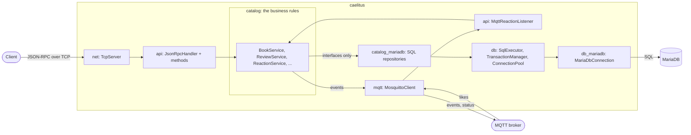
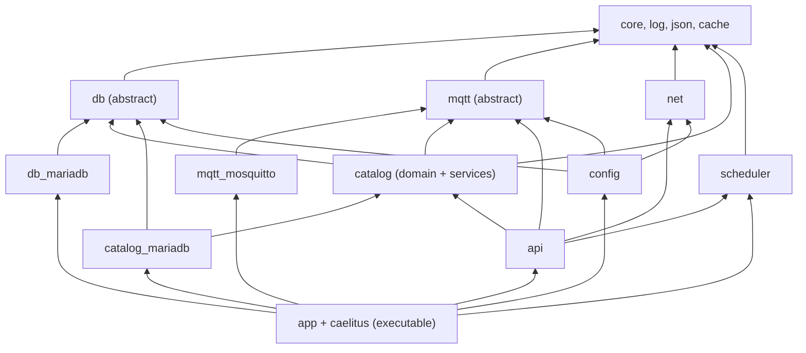
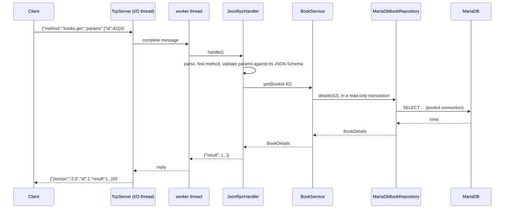
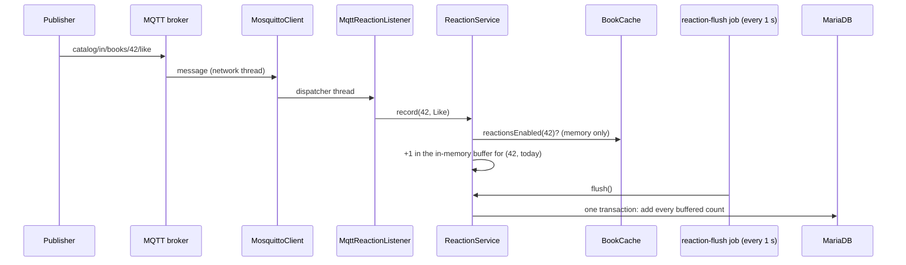
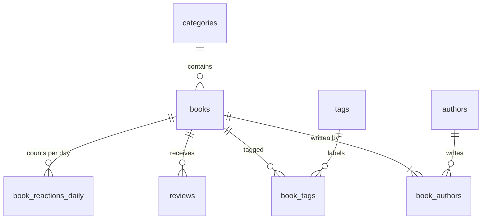

# caelitus

A book catalog server in modern C++ (C++17). Clients talk to it with
**JSON-RPC 2.0 over TCP**, the data lives in **MariaDB**, and readers' likes
and dislikes arrive as **MQTT** messages. A small web UI (in `web/`) sits on
top of it, but the server is the heart of the project, and this document is
about the server.

It is written as a guide for a developer who is new to the code: what each
part does, why it is built that way, how to build, run, test and change it.
Read it top to bottom once; afterwards use the table of contents.

```text
                    JSON-RPC over TCP (port 9000)
 clients / web UI  ──────────────────────────────────►  ┌──────────────┐      SQL      ┌──────────┐
                                                        │   caelitus   │ ───────────► │ MariaDB  │
 like/dislike      ── MQTT catalog/in/books/42/like ──► │  C++ server  │              └──────────┘
 senders           ◄─ MQTT catalog/books/42/created ─── └──────────────┘
                      (via the MQTT broker, e.g. mosquitto)
```

## Contents

1. [What the server does](#1-what-the-server-does)
2. [Quick start](#2-quick-start)
3. [Prerequisites](#3-prerequisites)
4. [Building](#4-building)
5. [Running the server](#5-running-the-server)
6. [Talking to the server: the JSON-RPC API](#6-talking-to-the-server-the-json-rpc-api)
7. [MQTT: likes in, events out](#7-mqtt-likes-in-events-out)
8. [Architecture](#8-architecture)
9. [The modules, one by one](#9-the-modules-one-by-one) (including [scheduled jobs and health](#scheduled-jobs-and-health))
10. [The database](#10-the-database)
11. [Configuration reference](#11-configuration-reference)
12. [Logging](#12-logging)
13. [Testing](#13-testing)
14. [Code documentation (Doxygen)](#14-code-documentation-doxygen)
15. [How to…: common changes, step by step](#15-how-to-common-changes-step-by-step)
16. [Conventions](#16-conventions)
17. [Troubleshooting](#17-troubleshooting)
18. [Limits and known trade-offs](#18-limits-and-known-trade-offs)
19. [Repository layout](#19-repository-layout)

---

## 1. What the server does

caelitus manages a catalog of **books**, their **authors**, **categories**
and free-form **tags**, readers' **reviews** (with a 1-5 rating), and
**likes/dislikes**.

| Feature | Details |
|---|---|
| Catalog CRUD | Create, read, update, delete categories, authors, books, reviews |
| Search | Books by category, author, tags (any/all), date range, title text, minimum rating, language; 5 sort orders; paging |
| Ratings | Every review change keeps the book's rating count and average exact, in the same transaction |
| Concurrency safety | Optimistic locking (`version`) on books and authors: two people editing the same book cannot overwrite each other |
| Likes/dislikes | Arrive over MQTT at high rate; counted in memory, written once a second; per-day history; rankings for today, yesterday, last 7/30 days, last year, all time |
| Events | Every book change and new review is published to MQTT for other systems |
| Self-describing API | `rpc.discover` returns an [OpenRPC](https://open-rpc.org) document; the web UI's TypeScript types are generated from it |
| Scheduled jobs | A built-in scheduler (`every 15s`, `rate 1s`, `cron 0 3 * * *` in Athens time) runs the periodic work; jobs are configured in `config.json` and can be listed, run, paused and resumed over JSON-RPC |
| Health | A health check every 15 seconds (database, MQTT, cache, server, likes, memory, threads, jobs) logs what goes wrong and answers `system.health` |
| Operations | Graceful shutdown (no request or like lost), automatic schema migrations, reconnects to MQTT and the database, an online/offline status topic, throttled logs |

The server is a single executable, `caelitus`, with a JSON configuration file.

---

## 2. Quick start

### Everything in Docker (nothing to install but Docker)

```bash
docker compose -f docker/compose.yml up -d --build    # first build takes a few minutes
```

Then open **http://localhost:8080**. You get MariaDB already filled with 528
sample books, an MQTT broker, the server and the web UI. For live likes on the
dashboard:

```bash
docker compose -f docker/compose.yml --profile simulate up -d simulator
```

Stop with `docker compose -f docker/compose.yml down` (add `-v` to delete the
database too). Ports and details are at the top of `docker/compose.yml`.

### Local development (what you will normally do)

```bash
# once: the database (MariaDB in Docker) and an MQTT broker
docker compose -f dev/docker-compose.yml up -d
docker run -d --name mosquitto -p 1883:1883 eclipse-mosquitto:2 mosquitto -c /mosquitto-no-auth.conf

# build and run the server
cmake --preset asan
cmake --build --preset asan
CAELITUS_DB_PASSWORD=caelitus-dev ./build/asan/src/caelitus

# in another terminal: sample data (once) and a request
docker exec -i caelitus-mariadb mariadb -ucaelitus -pcaelitus-dev caelitus < db/sample/catalog.sql   # only into an EMPTY database
printf '{"jsonrpc":"2.0","id":1,"method":"books.search","params":{"pageSize":2}}\0' | nc -q1 127.0.0.1 9000
```

> Load `catalog.sql` **before** the server's first start, or into a database
> you emptied: the server creates the schema itself on first start, and the
> script creates it too. Alternatively start the server first and load the
> data through the API: `cd web && npm install && npm run seed`.

---

## 3. Prerequisites

Developed and tested on **Ubuntu 24.04** with GCC 13 and clang 18. Anything
with a C++17 compiler and the libraries below works.

```bash
sudo apt install build-essential cmake git \
    libspdlog-dev nlohmann-json3-dev libasio-dev libmosquitto-dev libmariadb-dev \
    doxygen graphviz clang-format mosquitto-clients netcat-openbsd
```

| Dependency | Why | Notes |
|---|---|---|
| CMake ≥ 3.25 | Build system, presets | |
| spdlog ≥ 1.12 (+ fmt) | Logging | Downloaded automatically if missing |
| nlohmann/json ≥ 3.11 | JSON | Downloaded automatically if missing |
| Asio (standalone) | Asynchronous TCP | Downloaded automatically if missing |
| libmosquitto | MQTT client | Required |
| **MariaDB Connector/C++** | Database driver | Not in Ubuntu's repositories: install the `mariadb-connector-cpp` package from [MariaDB](https://mariadb.com/downloads/connectors/connectors-data-access/cpp-connector/), or build it from source as `docker/server.Dockerfile` does |
| Doxygen + Graphviz | API documentation | Optional (`docs` target) |
| Docker | Development database, integration tests, full stack | |
| Node.js 22 | Web UI, sample-data loader, like simulator | Only for `web/` |

---

## 4. Building

The build is described by `CMakeLists.txt` and **presets** in
`CMakePresets.json`. A preset is a named set of build options; CLion picks them
up automatically (Settings → Build → CMake shows them as profiles).

| Preset | Build type | Extras | Use it for |
|---|---|---|---|
| `asan` | Debug | AddressSanitizer + UndefinedBehaviorSanitizer | **Everyday development** (catches memory errors at once) |
| `debug` | Debug | | Debugging without sanitizer overhead |
| `tsan` | RelWithDebInfo | ThreadSanitizer | Hunting data races |
| `release` | Release | No tests | Deployment, benchmarks |

```bash
cmake --preset asan                   # configure into build/asan
cmake --build --preset asan        # build everything (server, libraries, tests)
ctest --preset unit                   # run the unit tests
```

Build outputs: the server is `build/<preset>/src/caelitus`; test executables
are in `build/<preset>/tests/`.

### Extra build targets

| Target | What it does |
|---|---|
| `docs` | C++ API documentation into `build/<preset>/docs/html/index.html` ([section 14](#14-code-documentation-doxygen)) |
| `schema` | Regenerates `db/schema.sql` from the migrations |
| `openrpc` | Regenerates `docs/openrpc.json` (the API description) |

Run one with `cmake --build --preset asan --target docs`.

### Compiler warnings

Every target compiles with `-Wall -Wextra -Wpedantic -Wshadow
-Wnon-virtual-dtor -Wold-style-cast -Woverloaded-virtual -Wcast-align
-Wimplicit-fallthrough -Wextra-semi -Wsign-conversion`, and the code builds
**without a single warning** on GCC and clang. Keep it that way; configure with
`-DCAELITUS_WARNINGS_AS_ERRORS=ON` to enforce it.

---

## 5. Running the server

```text
Usage: caelitus [options]

  --config <file>   Configuration file (see below for the default search).
  --openrpc         Print the API description (OpenRPC JSON) and exit.
  --schema          Print the database schema (SQL) and exit.
  --version         Print the version and exit.
  --help            Print this help and exit.
```

### What it needs

1. **A MariaDB database** it can log in to. The server creates and upgrades the
   tables itself (migrations), so an empty database is enough. For development,
   `dev/docker-compose.yml` starts one on `127.0.0.1:3306` with database and
   user `caelitus`, password `caelitus-dev`.
2. **An MQTT broker** (optional). Without one the server works normally; likes
   simply do not arrive and events are dropped, and it reconnects in the
   background when the broker appears.
3. **A configuration file**, `config/config.json`, found automatically (next
   section).

### Where the configuration is found

In this order; the first that exists wins:

1. `--config <path>`;
2. the `CAELITUS_CONFIG` environment variable;
3. `config/config.json` under the current directory;
4. `config/config.json` in the executable's directory or any directory above it.

Rule 4 means running `build/asan/src/caelitus` from anywhere inside the
repository finds the project's `config/config.json`.

### Secrets: environment variables

Any string value written as `"${NAME}"` is replaced by the environment variable
`NAME`; the server refuses to start if it is not set. The shipped configuration
uses this for the database password:

```bash
CAELITUS_DB_PASSWORD=caelitus-dev ./build/asan/src/caelitus
```

### Startup and shutdown

On start the server logs every step:

```text
[info] [app] caelitus 1.0.0 starting; configuration from /…/config/config.json
[info] [mqtt] Connected to 127.0.0.1:1883 as 'caelitus' (clean session: yes, session present: no, last will on 'caelitus/status')
[info] [db.migrations] Applying migration 001 (catalog: initial schema)        <- first start only
[info] [db.migrations] Database schema at version 003 (3 migration(s) applied)
[info] [app] Book cache loaded: 528 books
[info] [api.mqtt] Listening for reactions on catalog/in/books/<bookId>/like|dislike
[info] [server] Listening on 0.0.0.0:9000 (2 I/O threads, 8 workers, max 10000 connections)
[info] [scheduler] Scheduler started: 5 jobs (0 paused), 2 worker threads
[info] [app] Ready on port 9000: 32 API methods, 5 scheduled jobs
```

**Stop it with Ctrl+C or `kill <pid>`** (SIGINT/SIGTERM). The shutdown is
graceful and loses nothing:

1. the TCP server stops accepting and lets running requests finish (up to
   `shutdownTimeoutSec`);
2. the MQTT listener stops taking likes;
3. the scheduler stops planning jobs and waits for any running one;
4. the likes still buffered in memory are written to the database;
5. the MQTT client publishes `offline` to the status topic and disconnects.

**Exit codes:** `0` clean stop, `1` runtime error (e.g. database unreachable
at startup, port in use), `2` bad command line or configuration (including an
unknown job name in `scheduler.jobs`).

### Sample data

`db/sample/catalog.json` holds 528 real books (with their first publication
year), 328 authors, 14 categories and made-up reviews. Two ways to load it:

| Way | Command | When |
|---|---|---|
| SQL script | `mariadb … caelitus < db/sample/catalog.sql` | Into an **empty** database, server not needed. Includes 60 days of like history, relative to the day you load it |
| Through the API | `cd web && npm run seed` | Into a running server with an empty catalog; every rule is applied |

`db/sample/build.sh` regenerates `catalog.sql` after you edit the JSON
([section 10](#10-the-database)).

---

## 6. Talking to the server: the JSON-RPC API

### The protocol in one minute

[JSON-RPC 2.0](https://www.jsonrpc.org/specification) is a tiny convention for
calling functions with JSON. You send:

```json
{"jsonrpc": "2.0", "id": 1, "method": "books.get", "params": {"id": 42}}
```

and get back either a result or an error, with the same `id`:

```json
{"jsonrpc": "2.0", "id": 1, "result": {"id": 42, "title": "Dune", "...": "..."}}
{"jsonrpc": "2.0", "id": 1, "error": {"code": -32001, "message": "book 42 not found",
                                      "data": {"code": "not_found", "entity": "book", "id": 42}}}
```

**Transport:** a plain TCP connection to port 9000. Every message, in both
directions, is one JSON document followed by a **NUL byte (`\0`)**; that is how
each side knows where a message ends. A connection can carry any number of
requests; answers come back in request order.

Also supported: **batches** (a JSON array of up to 100 requests, answered with
an array) and **notifications** (a request without `id`, which gets no answer).
Parameters are always passed **by name** (an object), never by position.

### Trying it from the shell

```bash
rpc() { printf '%s\0' "$1" | nc -q1 127.0.0.1 9000 | tr -d '\0'; echo; }

rpc '{"jsonrpc":"2.0","id":1,"method":"system.ping"}'
rpc '{"jsonrpc":"2.0","id":2,"method":"books.search","params":{"title":"dune","sort":"publishedAsc","pageSize":5}}'
rpc '{"jsonrpc":"2.0","id":3,"method":"reactions.top","params":{"period":"last7Days","limit":3}}'
```

Or from Python:

```python
import json, socket

def call(method, params=None, id=1):
    with socket.create_connection(("127.0.0.1", 9000)) as s:
        s.sendall(json.dumps({"jsonrpc": "2.0", "id": id, "method": method, "params": params or {}}).encode() + b"\0")
        data = b""
        while not data.endswith(b"\0"):
            data += s.recv(65536)
        return json.loads(data[:-1])

print(call("books.get", {"id": 1}))
```

The web gateway also exposes the same API over HTTP:
`curl -H 'content-type: application/json' localhost:8080/rpc -d '{…}'`.

### The methods

| Method | Parameters (* required) | Does |
|---|---|---|
| `categories.list` | | All categories, by name |
| `categories.get` | `id`* | One category |
| `categories.create` | `name`*, `slug` | Creates a category; the slug is derived from the name if omitted |
| `categories.update` | `id`*, `name`*, `slug` | Renames a category |
| `categories.delete` | `id`* | Deletes a category no book uses |
| `authors.search` | `name`, `page`, `pageSize` | Authors by name (substring), alphabetically |
| `authors.get` | `id`* | One author |
| `authors.create` | `name`*, `bio`, `birthDate` | Creates an author |
| `authors.update` | `id`*, `version`*, `name`*, `bio`, `birthDate` | Replaces an author's fields (optimistic locking) |
| `authors.delete` | `id`* | Deletes an author who has no books |
| `books.search` | `categoryId`, `authorId`, `tags`, `tagMatch`, `publishedFrom`, `publishedTo`, `title`, `minRating`, `language`, `sort`, `page`, `pageSize` | Searches books |
| `books.get` | `id`* | One book with all its details |
| `books.create` | `title`*, `isbn`, `description`, `publishedOn`*, `language`*, `pageCount`, `categoryId`*, `authorIds`*, `tags`, `reactionsEnabled` | Creates a book |
| `books.update` | `id`*, `version`*, and the fields of `books.create` (not `reactionsEnabled`) | Replaces a book's fields, authors and tags |
| `books.setReactionsEnabled` | `id`*, `enabled`* | Turns likes/dislikes on or off for a book |
| `books.delete` | `id`* | Deletes a book with its reviews and likes |
| `tags.list` | | Tags in use, with how many books carry each |
| `reviews.list` | `bookId`*, `page`, `pageSize` | A book's reviews, newest first |
| `reviews.get` | `id`* | One review |
| `reviews.create` | `bookId`*, `reviewerName`*, `rating`*, `title`, `body`* | Adds a review; updates the book's rating |
| `reviews.update` | `id`*, `reviewerName`*, `rating`*, `title`, `body`* | Replaces a review; updates the book's rating |
| `reviews.delete` | `id`* | Deletes a review; updates the book's rating |
| `reactions.get` | `bookId`* | A book's likes and dislikes for every period |
| `reactions.top` | `period`*, `order`, `limit` | Most liked (or disliked) books in a period |
| `scheduler.list` | | Every scheduled job: schedule, paused/running, next run, last result and error, counters |
| `scheduler.get` | `name`* | One job |
| `scheduler.run` | `name`* | Runs a job now (also while paused); Conflict `job_running` if it is running |
| `scheduler.pause` | `name`* | Stops a job's scheduled runs (until resumed or restart) |
| `scheduler.resume` | `name`* | Resumes a paused job; its next run is planned from now |
| `system.health` | | The latest health report (refreshed every 15 s) |
| `system.ping` | | Liveness check |
| `rpc.discover` | | The OpenRPC description of all of the above |

Enumerations: `sort` is `publishedDesc` (default), `publishedAsc`, `titleAsc`,
`ratingDesc` or `createdDesc`; `tagMatch` is `any` (default) or `all`;
`period` is `today`, `yesterday`, `last7Days`, `last30Days`, `lastYear` or
`allTime`; `order` is `mostLiked` (default) or `mostDisliked`.

**The complete, exact description** of every parameter, result and error is
`docs/openrpc.json` (the same as `rpc.discover` returns). Paste it into
<https://playground.open-rpc.org> to browse it, or read it in the web UI's
"API" page.

### Conventions

- **Ids** are positive integers. **Dates** are `"YYYY-MM-DD"`; **timestamps**
  are RFC 3339 in UTC (`"2026-10-03T07:51:52.925539Z"`).
- **Absent optional values** are `null` in results; in requests, `null` and
  "not given" mean the same.
- **Lists** are paged: `page` starts at 1, `pageSize` is 1-100 (default 20); the
  result has `items`, `total`, `page`, `pageSize`, `pageCount`.
- **Text** is UTF-8 and lengths are counted in characters, so Greek titles have
  the same limits as Latin ones.
- **Optimistic locking**: `books.get` returns a `version`. Pass it to
  `books.update`; if someone changed the book in between, you get a Conflict
  error with `data.code = "version_conflict"` and nothing is changed: reload
  and try again.

### Errors

| `error.code` | Meaning | `error.data` |
|---|---|---|
| -32700 | The message is not valid JSON | |
| -32600 | Valid JSON, but not a JSON-RPC request | `reason` |
| -32601 | Unknown method | |
| -32602 | **Invalid params**: missing, unknown, wrong type, or a business rule rejected the value | `field`, `reason` (and `code: "validation_failed"` for business rules) |
| -32001 | **Not found** | `code: "not_found"`, `entity`, `id` (for jobs, the name) |
| -32002 | **Conflict** with the current state | `code`: `isbn_taken`, `name_taken`, `slug_taken`, `author_has_books`, `category_in_use`, `version_conflict`, `stale_reference`, `job_running` |
| -32003 | **Unavailable**: the database is temporarily unreachable or overloaded; retry later | |
| -32603 | **Internal error**: a bug or a permanent database problem. The details are in the server log, never sent to the client | |

Example: an unknown parameter is reported with the list of accepted ones, which
makes typos obvious:

```json
{"code": -32602, "message": "Invalid params",
 "data": {"field": "titleContains", "reason": "unknown parameter",
          "accepted": ["categoryId", "authorId", "tags", "tagMatch", "publishedFrom", "publishedTo",
                       "title", "minRating", "language", "sort", "page", "pageSize"]}}
```

---

## 7. MQTT: likes in, events out

[MQTT](https://mqtt.org) is a lightweight publish/subscribe protocol: clients
publish messages to named **topics** on a **broker** (here mosquitto), and the
broker forwards them to every client subscribed to a matching topic.

### In: likes and dislikes

| Topic | Payload | Effect |
|---|---|---|
| `catalog/in/books/<id>/like` | anything (ignored) | One like for book `<id>` |
| `catalog/in/books/<id>/dislike` | anything (ignored) | One dislike |

Only books with `reactionsEnabled = true` count reactions (it is off for new
books; turn it on with `books.setReactionsEnabled`). Others, unknown books and
malformed topics are ignored (and logged, throttled). Try it:

```bash
mosquitto_pub -t catalog/in/books/1/like -n
```

The like shows up in `reactions.get` within a second (see
[how likes are counted](#likes-reactionservice)).

### Out: catalog events

| Topic | Payload | When |
|---|---|---|
| `catalog/books/<id>/created` | the title | A book was created |
| `catalog/books/<id>/updated` | the title | A book was updated |
| `catalog/books/<id>/deleted` | empty | A book was deleted |
| `catalog/books/<id>/reviews` | `"<rating> <reviewer>"` | A review was added |
| `catalog/stats/top-today` | JSON array of `{bookId, title, likes, dislikes, score}` (retained) | Every minute (`top-books` job) |

Events are published **after** the database transaction commits, so a listener
never hears about a change that was rolled back. Delivery is best effort: if
the broker is down, events are dropped (and counted), and the API call still
succeeds.

### Status: is the server online?

The server keeps a **retained** message on `caelitus/status`: `online` while
it runs, `offline` when it stops. Retained means the broker stores the last
value and hands it to anyone who subscribes later, so a dashboard learns the
current state immediately:

```bash
mosquitto_sub -t caelitus/status -v
```

If the server crashes, the broker itself publishes `offline` (MQTT's "last
will"), at once if the process died, or after about 1.5 × keep-alive (45 s) if
the network silently dropped.

---

## 8. Architecture

### The big picture



### The one rule that shapes the code

**The business logic does not know which database or MQTT library is behind
it.** `catalog::BookService` talks to interfaces: `IBookRepository` (store and
load books), `db::ITransactionManager` (group several calls atomically) and
`mqtt::IMqttPublisher` (send an event). The MariaDB SQL, the MariaDB driver and
libmosquitto live in separate libraries that the services cannot even link
against.

Why it is worth it:

- **Fast, reliable tests.** Every service is tested with in-memory fakes
  (`tests/CatalogFakes.hpp`): 28 service tests run in a fraction of a second
  with no database.
- **Replaceable parts.** Moving to PostgreSQL would mean new repositories and a
  new driver; not one line of a service would change.
- **Readable services.** A service reads like the use case it implements, with
  no SQL or socket code in the way.

Only one place sees everything: `app::Application` (`src/app/Application.cpp`),
which creates every component and wires them together. That pattern is called
a *composition root*.

### Libraries ("modules")

The code is split into small static libraries, each with one job. An arrow
means "uses":



| Library | Directory | Purpose |
|---|---|---|
| `log` | `log/` | Named loggers (spdlog), log throttling |
| `core` | `core/` | Dates and timestamps, time zones, domain errors |
| `json` | `json/` | JSON conversions for core types (header-only) |
| `cache` | `cache/` | Thread-safe in-memory key/value cache (header-only) |
| `scheduler` | `scheduler/` | Periodic jobs: every / rate / cron schedules, pause, resume, run now, status |
| `db` | `db/` | Connection pool, SQL execution, transactions with retries, migrations, error hierarchy |
| `db_mariadb` | `db/mariadb/` | The MariaDB driver behind `db` |
| `mqtt` | `mqtt/` | MQTT client logic: subscriptions, dispatch, status, statistics |
| `mqtt_mosquitto` | `mqtt/mosquitto/` | The libmosquitto transport behind `mqtt` |
| `net` | `net/` | Asynchronous TCP server for `\0`-terminated messages |
| `catalog` | `catalog/domain/`, `catalog/service/` | The business: entities, rules, services |
| `catalog_mariadb` | `catalog/mariadb/` | SQL implementations of the catalog repositories; the schema migrations |
| `api` | `api/` | JSON-RPC protocol, the catalog and operations (scheduler, health) methods, OpenRPC, the MQTT like listener |
| `config` | `config/` | Loading and validating `config.json` |
| `app` + executable | `app/` | `Application` (wiring, the job list), `HealthMonitor`, and `main()` |

Each library's **public headers** are in `include/caelitus/<dir>/`; its `.cpp`
files and **private headers** are in `src/<dir>/`. Code outside a library may
only include its public headers: `#include "caelitus/db/SqlExecutor.hpp"`.

### Life of a request



1. **`net::TcpServer`** reads bytes on an I/O thread until it sees `\0`, then
   hands the complete message to a **worker** thread. I/O threads never wait on
   the database, so one slow query cannot freeze other clients.
2. **`api::JsonRpcHandler`** parses the JSON, finds the method, and checks
   `params` against the method's **JSON Schema** (types, ranges, lengths,
   required and unknown fields) before any code of the method runs.
3. The method converts JSON into C++ types and calls the **service**.
4. The **service** applies the rules and calls repositories inside a
   transaction.
5. The **repository** runs SQL through `db::SqlExecutor`, which uses the
   connection of the current transaction.
6. The result goes back up; an exception on the way becomes the matching
   JSON-RPC error ([table above](#errors)).

### Life of a like



A like costs a hash map increment; the database sees one small transaction per
second, however many likes arrive. At 100 likes/s the server's CPU use is
negligible.

### Threads

| Thread(s) | Count | Does |
|---|---|---|
| main | 1 | Starts everything, then waits for SIGINT/SIGTERM |
| TCP I/O | `server.ioThreads` (2) | Socket reads/writes for all connections |
| TCP workers | `server.workerThreads` (8) | Run API methods (they block on the database) |
| MQTT network | 1 | libmosquitto's socket loop, reconnects |
| MQTT dispatcher | 1 | Runs message handlers (the like listener) |
| scheduler timer | 1 | Decides which job is due; watches job timeouts |
| scheduler workers | `scheduler.threads` (2) | Run the jobs (flush likes, reload the cache, health, ...) |

Everything shared between threads is protected: services and repositories are
stateless or use their own locks; the pool, the cache and the MQTT client are
thread-safe. The test suite runs clean under ThreadSanitizer.

---

## 9. The modules, one by one

### core

- `Timestamp`: a UTC point in time with microsecond precision, the finest the
  database stores. `Date`: a calendar day with no time zone; always valid.
  Conversions to and from ISO 8601 text.
- `TimeZone`: "UTC" or European zones ("Europe/Athens") with the EU daylight
  saving rule built in. Used to decide which **day** a like belongs to.
- `DomainError` and subclasses `ValidationError`, `NotFoundError`,
  `ConflictError`: what services throw. Each has a stable `code()`.

### db: database access without a particular database

| Class | Role |
|---|---|
| `IConnection`, `IConnectionFactory` | The driver interface: the only thing that knows the database product |
| `ConnectionPool` | Reuses connections (opening one costs a few ms); limits their number; pings idle ones before reuse; drops broken ones |
| `SqlExecutor` | What repositories use: `execute`, `insert`, `query`, `queryOne`, `queryScalar`, `queryList`. Always with `?` placeholders |
| `ITransactionManager`, `TransactionManager` | `tx.inTransaction([&] { ... })`: everything inside is one transaction |
| `MigrationRunner` | Applies versioned schema changes at startup |
| `DatabaseError` hierarchy | Every driver error is translated into one of these |

**How a statement finds its transaction.** Inside `inTransaction()` the
transaction's connection is registered for the current thread. `SqlExecutor`
looks there first; outside a transaction it borrows a connection from the
pool for that one statement (autocommit). That is why services can call several
repositories in one transaction without passing a connection around.

**Retries.** Databases sometimes abort a transaction for reasons that a retry
fixes: a deadlock (two transactions waiting for each other), a lock wait
timeout, a dropped connection. `TransactionManager` retries the **whole**
transaction (up to `maxAttempts`, with growing pauses). Consequence for you: the
code inside `inTransaction()` may run more than once, so it must not do
anything outside the database (no MQTT publishes, no emails). Do those after
`inTransaction()` returns.

**Safety nets.** If code inside a transaction catches a database error and
carries on, the transaction is still rolled back: committing half a use case
would corrupt data. If the connection drops *during* COMMIT, the outcome is
unknown, and the transaction is never retried (it might apply twice).

**Errors.** `DatabaseError` has subclasses for connection problems, pool
timeouts, transient errors (deadlocks), duplicate keys, foreign keys, query
errors and data mapping errors; `isTransient()` says whether a retry may help.
Repositories turn the ones with domain meaning (a duplicate ISBN) into
`ConflictError`; the API turns transient ones into "Unavailable" (-32003).

### catalog: the business

**Domain** (`catalog/domain/`): plain structs (`Book`, `Author`, `Category`,
`Review`, `Tag`), typed ids (`BookId` and `AuthorId` are different types, so
they cannot be mixed up), the search query (`BookQuery`), and the repository
interfaces. `Rules.hpp` holds validation and normalization: ISBN check digits
(ISBN-10 is converted to ISBN-13), tag normalization (trimmed, lower case,
single spaces), slugs, languages, text lengths.

**Services** (`catalog/service/`), one per area:

| Service | Notable behavior |
|---|---|
| `CategoryService` | Slugs derived from names; delete refused while books use the category |
| `AuthorService` | Optimistic locking; delete refused while the author has books |
| `BookService` | Checks that category and authors exist; creates unknown tags; optimistic locking; refreshes the book cache and publishes an event after each commit |
| `ReviewService` | Keeps the book's rating totals exact: the review and the totals change in one transaction, with row locks so concurrent reviews cannot lose an update |
| `ReactionService` | Likes and dislikes ([below](#likes-reactionservice)) |

**Optimistic locking**, briefly: every book has a `version`. An update says "I
read version 3"; the SQL is `UPDATE … WHERE id = ? AND version = 3`, which also
sets `version = 4`. If someone else updated first, no row matches and the
caller gets `version_conflict`. No locks are held while a person edits a form.

<a id="likes-reactionservice"></a>**Likes (ReactionService).**
`record()` only increments a counter in memory, keyed by (book, local day).
Every second `flush()` swaps the buffer out and writes it in one transaction:
the per-day table and the all-time totals on the book row. If the database is
down, the counts go back into the buffer and are retried at the next flush; the
buffer has an upper bound (`maxBuffered` book-days) so memory cannot grow
without limit during a long outage. "Today" is decided in the catalog's time
zone (default Europe/Athens), so a like at 01:30 Athens time on 4 October counts
for 4 October even though it is still 3 October in UTC.

**BookCache.** Every like must check "does book 42 accept reactions?". Asking
the database 100 times a second would be wasteful, so every book's id, title and
`reactionsEnabled` flag are kept in memory. `BookService` refreshes an entry
right after each change; a full reload every 5 minutes catches edits made
directly in the database.

### catalog_mariadb: the SQL

One repository class per interface. They contain SQL and row mapping only.
Dynamic searches build their WHERE clause with `SqlFilter`, which keeps
conditions and their parameters side by side: **values are never pasted into SQL
text**, which rules out SQL injection. Lists load the authors and tags of a
whole page in two extra queries, not one per book (the "N+1 queries" trap).

`CatalogMigrations.cpp` holds the schema as numbered migrations.

### api: JSON-RPC

- `JsonRpcHandler` implements the protocol (parsing, batches, notifications,
  error mapping) and is the TCP server's message handler.
- `CatalogApi.cpp` declares every method with `MethodBuilder`: name, summary,
  parameters with their JSON Schemas, result schema, possible errors, and the
  handler. One declaration serves three purposes: **request validation**, the
  **OpenRPC document**, and the **generated TypeScript types** of the UI. The
  documentation cannot drift from the code, and the tests check that every
  result matches its declared schema.
- `MqttReactionListener` subscribes to the like topics and calls
  `ReactionService::record()`.

### net: the TCP server

Built on [Asio](https://think-async.com/Asio/). A few I/O threads serve all
connections (no thread per connection). It protects itself: a connection limit,
a maximum message size (1 MiB), a limit of pipelined requests per connection
(beyond it the server stops reading from that client: backpressure), and an idle
timeout. It knows nothing about JSON; it only moves `\0`-terminated messages.

### mqtt: the MQTT client

`MqttClientBase` contains everything that does not depend on the library:

- a **subscription registry**, re-sent on every reconnect (the broker forgets
  subscriptions of clean sessions);
- a **dispatcher thread** that runs handlers, so a slow handler never blocks
  the network thread and its keep-alive pings;
- a bounded **incoming queue** (messages beyond it are dropped and counted);
- the **online/offline status** (last will); careful ordering guarantees that a
  stop right after a connect never leaves the status stuck at "online";
- statistics and throttled logs.

`MosquittoClient` adds the libmosquitto calls: about 170 lines.

### config

`AppConfig::load()` reads `config.json` (comments allowed), substitutes
`${ENV}` values, applies defaults, and validates every value. **Unknown keys are
errors**: a typo such as `"prot": 9000` stops the server with
`…/config.json: server.prot: unknown key` instead of being silently ignored.

### Scheduled jobs and health

Everything the server does on a timer runs as a named **job** on a
`scheduler::Scheduler`: one timer thread decides what is due, a small pool of
worker threads runs the jobs, so a slow job delays nothing else.

| Job | Default schedule | Does |
|---|---|---|
| `reaction-flush` | `rate 1s` | Writes the buffered likes/dislikes to the database |
| `book-cache-reload` | `every 5min` | Reloads every book into the in-memory cache (catches edits made outside the server) |
| `health` | `every 15s` (and at start) | Checks the whole server; logs problems; feeds `system.health` |
| `reaction-cleanup` | `cron 0 3 * * *` | At 03:00 Athens time, deletes per-day like counts older than `catalog.reactions.keepDays` (all-time totals stay) |
| `top-books` | `every 1min` (and at start) | Publishes today's top 10 as retained JSON to `catalog/stats/top-today` |

**Schedules** have three forms:

| Form | Meaning |
|---|---|
| `every 15s` | 15 seconds after the previous run **finished**: runs never pile up |
| `rate 1s` | Every second from the previous **planned** start; if the server falls behind, missed runs are skipped, not caught up in a burst |
| `cron 0 3 * * *` | Classic 5-field cron (`minute hour day month weekday`, with `*`, ranges `1-5`, lists `1,15`, steps `*/10`, names `mon`, `jan`), in `catalog.timeZone`. On the night clocks go forward a time in the skipped hour does not happen; on the night they go back it happens once |

Durations take `ms`, `s`, `min`, `h` or `d`.

**Rules every job follows:**

- A job **never runs twice at the same time**; if it is still running when due
  again, that run is skipped.
- An exception thrown by a job is a **failure**: it is logged (at most once a
  minute per job), kept in the job's status, and retried if the job has
  `retryAttempts` (with a doubling delay), otherwise the job waits for its next
  regular run. When a failing job succeeds again, an info line says so.
- A run longer than its `timeoutSec` is logged as a warning (it is not killed:
  C++ cannot safely stop a thread). On shutdown, running jobs see
  `JobContext::stopRequested()` and the scheduler waits for them.

**Control over JSON-RPC:** `scheduler.list` shows every job (schedule, paused,
running, next run, last result, last error, counters); `scheduler.run`,
`scheduler.pause` and `scheduler.resume` act on one by name. Pausing is not
saved: after a restart, `"enabled": false` in the configuration decides.

```bash
rpc '{"jsonrpc":"2.0","id":1,"method":"scheduler.list"}'
rpc '{"jsonrpc":"2.0","id":2,"method":"scheduler.pause","params":{"name":"top-books"}}'
rpc '{"jsonrpc":"2.0","id":3,"method":"scheduler.run","params":{"name":"reaction-cleanup"}}'
```

**Configuration** (section `scheduler`; see [section 11](#11-configuration-reference)):
list a job only to change it.

```json
"scheduler": {
  "threads": 2,
  "jobs": {
    "health": { "schedule": "every 30s" },
    "reaction-cleanup": { "schedule": "cron 30 4 * * sun", "retryAttempts": 5 },
    "top-books": { "enabled": false }
  }
}
```

A job name that does not exist is an error at startup (with the list of known
jobs), so a typo cannot silently disable nothing.

#### The health job

Every 15 seconds `app::HealthMonitor` measures the server and keeps the result
for `system.health`:

| Part | Measured | Reported as a problem when |
|---|---|---|
| Database | a `SELECT 1` round trip; open/idle/max pool connections | the query fails; it takes longer than `health.slowDatabaseMs`; every connection is in use |
| MQTT | connected; messages sent, dropped, received | the broker is not connected |
| Book cache | books, estimated memory, hits/misses | (information only) |
| TCP server | connections, requests, errors | (information only) |
| Likes | book-days buffered, likes dropped | the buffer is fuller than `health.reactionBufferWarnPercent`; likes were dropped since the last check |
| Process | resident memory, threads, uptime | memory above `health.maxMemoryMb` (when set) |
| Jobs | total, paused, running, failing | another job's last run failed |

The log tells the story without repeating it every 15 seconds: a **new problem
is logged as a warning at once**, then at most every 5 minutes while it lasts;
when it goes away an **info line says "resolved"**; every check also writes one
`debug` line with the main figures. For example, with the database stopped for
a few seconds:

```text
[warning] [health] Health: database unreachable: Query failed [SELECT 1]: … Lost connection to server during query
[info]    [health] Health: resolved: database unreachable: …
```

```bash
rpc '{"jsonrpc":"2.0","id":1,"method":"system.health"}'
# {"status":"ok","problems":[],"uptimeSeconds":3600,"database":{"up":true,"pingMs":0.6,...},
#  "bookCache":{"books":528,"approxBytes":50897,...},"process":{"memoryBytes":122400768,"threads":16},...}
```

---

## 10. The database

### Tables



| Table | Holds |
|---|---|
| `categories` | id, name (unique), slug (unique) |
| `authors` | id, name, bio, birth_date, version, timestamps |
| `books` | id, title, isbn (unique), description, published_on, language, page_count, category_id, rating_count/rating_sum, likes/dislikes and the generated `reaction_score`, reactions_enabled, version, timestamps |
| `book_authors` | book ↔ author links, with `position` (cover order) |
| `tags`, `book_tags` | tag names and book ↔ tag links |
| `reviews` | id, book_id, reviewer_name, rating (1-5), title, body, timestamps |
| `book_reactions_daily` | (book_id, day) → likes, dislikes |
| `schema_migrations` | which migrations are applied, with checksums |

All text is `utf8mb4` (full Unicode, Greek and emoji included); all timestamps
are stored in UTC (the session time zone is forced to `+00:00`). Deleting a book
deletes its links, reviews and reactions (`ON DELETE CASCADE`); deleting an
author or a category that is still used is refused (foreign key, reported as
`author_has_books` / `category_in_use`).

`db/schema.sql` is the complete schema as one script, generated from the
migrations (`cmake --build --preset asan --target schema`); a test fails if it
is out of date.

### Migrations

The schema is never edited by hand. Each change is a numbered **migration** in
`src/catalog/mariadb/CatalogMigrations.cpp`; at startup `MigrationRunner`
applies the ones not yet recorded in `schema_migrations`. It refuses to start if
a migration that was already applied has been edited (checksum mismatch) or if
the database is newer than the code. Two servers starting at once do not
migrate twice (a database lock serializes them).

> MariaDB commits schema changes (DDL) immediately, so a migration that fails
> half-way is not rolled back. Keep migrations small; if one fails, fix the
> database by hand, then start again.

### Sample data

| File | What |
|---|---|
| `db/sample/catalog.json` | **The source**: categories, 528 books, reviewers, review texts |
| `db/sample/catalog.sql` | Generated: schema + data in one script for an empty database |
| `db/sample/reaction-history.sql` | Part of `catalog.sql`: 60 days of likes relative to the load date (deterministic) |
| `db/sample/build.sh` | Regenerates `catalog.sql` |

`build.sh` runs a throwaway MariaDB container and the real server, loads the
JSON through the API (so every rule applies), dumps the data, and finally loads
the result into an empty database to prove it works. To add books: edit the
JSON, run `db/sample/build.sh`, run the tests (`app_tests` checks every sample
book against the service rules).

---

## 11. Configuration reference

`config/config.json`. Every key is optional unless marked **required**;
durations carry their unit in the name.

### `mqtt`

| Key | Default | Meaning |
|---|---|---|
| `server` | **required** | Broker host |
| `port` | 1883 | Broker port |
| `clientId` | `caelitus` | Must be unique per running instance |
| `username`, `password` | empty | Broker credentials |
| `keepAliveSec` | 30 | Ping interval; the broker considers the client gone after ~1.5× without traffic |
| `qos` | 0 | Default QoS for publishes and subscriptions (0, 1 or 2) |
| `retain` | false | Default retain flag for publishes |
| `cleanSession` | true | false: the broker keeps subscriptions and QoS 1/2 messages while we are offline |
| `reconnectMinDelaySec`, `reconnectMaxDelaySec` | 1, 30 | Reconnect backoff range |
| `incomingQueueSize` | 10000 | Received messages waiting for handlers |
| `will.topic` | (no status topic) | e.g. `caelitus/status`; enables the online/offline status |
| `will.payload`, `will.onlinePayload` | `offline`, `online` | Status values |
| `will.qos`, `will.retain` | 1, true | For the status messages |

### `db`

| Key | Default | Meaning |
|---|---|---|
| `host`, `port` | 127.0.0.1, 3306 | Server address |
| `user`, `database` | **required** | Account and schema |
| `password` | empty | Use `"${CAELITUS_DB_PASSWORD}"` |
| `connectTimeoutMs`, `socketTimeoutMs` | 5000, 30000 | Network timeouts (0 disables the socket timeout) |
| `sessionTimeZone` | `+00:00` | Keep UTC |
| `initStatements` | [] | SQL run on every new connection |
| `slowQueryMs` | 500 | Statements slower than this are logged as warnings |
| `pool.maxSize` | 8 | Most connections at once |
| `pool.acquireTimeoutMs` | 5000 | Wait for a free connection before failing (-32003) |
| `pool.validateAfterIdleMs` | 30000 | Ping connections idle longer than this before reuse |
| `transaction.maxAttempts` | 3 | Attempts for transient failures, including the first |
| `transaction.initialBackoffMs`, `backoffMultiplier` | 20, 2.0 | Pause before the 2nd attempt, and growth factor |
| `transaction.slowTransactionMs` | 2000 | Transactions longer than this are logged as warnings |

### `server`

| Key | Default | Meaning |
|---|---|---|
| `port` | **required** | TCP port (9000 in the shipped file) |
| `bindAddress` | `0.0.0.0` | `127.0.0.1` to accept local clients only |
| `ioThreads` | 2 | Socket I/O threads |
| `workerThreads` | 8 | Threads running API methods; about the pool size |
| `maxConnections` | 10000 | Further connections are closed at once |
| `maxMessageBytes` | 1048576 | Larger messages are a protocol error |
| `maxPendingRequests` | 16 | Pipelined requests per connection before reading pauses |
| `idleTimeoutSec` | 300 | Close silent connections |
| `slowRequestMs` | 500 | Slower requests are logged as warnings |
| `shutdownTimeoutSec` | 10 | Grace period for running requests on stop |
| `log` | `info` | Level of the `server` logger |

### `catalog`

| Key | Default | Meaning |
|---|---|---|
| `timeZone` | `Europe/Athens` | What "today" means for likes, and the time zone of cron schedules (`UTC` or a European zone) |
| `reactions.topicPrefix` | `catalog/in/books` | Likes arrive on `<prefix>/<id>/like` |
| `reactions.maxBuffered` | 100000 | Book-days kept in memory between flushes |
| `reactions.keepDays` | 400 | Per-day like counts kept by `reaction-cleanup` (at least 366, so "last year" stays exact) |
| `reactions.topTopic` | `catalog/stats/top-today` | Where `top-books` publishes |

How often likes are written and the cache reloaded are now job schedules
(`reaction-flush`, `book-cache-reload`) in `scheduler`.

### `scheduler`

| Key | Default | Meaning |
|---|---|---|
| `threads` | 2 | Jobs that can run at the same time |
| `jobs.<name>.schedule` | per job (see [the job list](#scheduled-jobs-and-health)) | `every …`, `rate …` or `cron …` |
| `jobs.<name>.enabled` | true | false: the job starts paused (it can still be run by hand) |
| `jobs.<name>.timeoutSec` | per job (0: none) | Runs longer than this are logged as warnings |
| `jobs.<name>.jitterSec` | 0 | Random delay before the first run |
| `jobs.<name>.retryAttempts` | per job | Retries after a failure before waiting for the next regular run |
| `jobs.<name>.retryDelaySec` | per job | First retry delay; doubles for each further retry |

### `health`

| Key | Default | Meaning |
|---|---|---|
| `slowDatabaseMs` | 500 | A test query slower than this is a problem |
| `maxMemoryMb` | 0 | Resident memory above this is a problem; 0: not checked |
| `reactionBufferWarnPercent` | 80 | A like buffer fuller than this is a problem |

### `log`

| Key | Default | Meaning |
|---|---|---|
| `level` | `info` | `trace`, `debug`, `info`, `warn`, `error`, `critical`, `off` |
| `levels` | {} | Per-logger levels, e.g. `{"db.sql": "trace"}` |
| `console` | true | Log to the terminal (colored) |
| `file` | empty | Also log to this file, rotated |
| `maxFileSizeMb`, `maxFiles` | 10, 5 | Rotation |
| `pattern` | see `Log.hpp` | spdlog line format |

---

## 12. Logging

Every line shows time, level, **logger name**, thread id and message:

```text
2026-10-03 07:51:52.925 [warn] [db.sql] [t50013] Slow SQL: 612.3 ms (threshold 500 ms), 20 rows: SELECT …
```

Each component logs under its own name, so you can turn up one area without
drowning in the rest (`"levels": {"db.sql": "trace"}` shows every SQL statement
with its duration):

| Logger | Component |
|---|---|
| `app` | Startup, shutdown, wiring |
| `server` | TCP connections and requests |
| `api`, `api.mqtt` | JSON-RPC failures; the like listener |
| `db.pool`, `db.sql`, `db.tx`, `db.migrations` | Connections; statements; transactions and retries; schema |
| `mqtt`, `mqtt.lib` | The MQTT client; libmosquitto's own messages |
| `catalog.reactions`, `cache.books` | Like buffering and flushing; the book cache |
| `scheduler` | Jobs: start/stop, pause/resume/run by hand, failures, recoveries, timeouts (each run at debug) |
| `health` | Problems found by the health job and their resolution (each check at debug) |

**Throttling.** A repeating problem (the broker is down, the database refuses
connections) would otherwise write thousands of identical lines. Such messages
are logged at most once a minute, with a count of what was suppressed:
`Message dropped: not connected (+5821 similar since last report)`.

**Levels** follow one rule: `error` needs a human, `warn` is unusual but
handled, `info` is the story of the process (start, stop, connect), `debug` and
`trace` are for development.

---

## 13. Testing

### The test suites

| Suite | Kind | Covers |
|---|---|---|
| `datetime_tests` | unit | Dates, timestamps, ISO 8601, time zones and DST, local ↔ UTC |
| `scheduler_tests` | unit | Schedule parsing, cron (incl. summer-time changes), no overlap, pause/resume, manual runs, retries, timeouts, shutdown |
| `db_tests` | unit | Pool, executor, transactions, retries, migrations, error translation (with a fake driver) |
| `config_tests` | unit | Configuration parsing, validation, `${ENV}`, file lookup |
| `mqtt_tests` | unit | Topic rules, subscriptions, dispatch, status, reconnects (fake transport) |
| `tcp_tests` | unit | Framing, ordering, limits, backpressure, shutdown (real sockets on localhost) |
| `cache_tests`, `catalog_service_tests` | unit | The cache (incl. its memory estimate); every service rule (in-memory fakes) |
| `api_tests` | unit | JSON-RPC protocol, every method over fakes, results checked against their schemas, OpenRPC |
| `app_tests` | unit | Generated files are current; sample data passes the rules |
| `db_integration_tests` | integration | The MariaDB driver and the db layer against a real server |
| `catalog_integration_tests` | integration | The SQL repositories against a real server |
| `mqtt_integration_tests` | integration | The MQTT client against a real broker |
| `app_integration_tests` | integration | The real `Application` end to end: catalog over TCP, likes over MQTT, scheduled jobs and health over JSON-RPC |

**Unit tests** need nothing external and run in seconds:

```bash
ctest --preset unit             # or: ctest --test-dir build/asan -L unit
```

**Integration tests** need a database and/or broker. Without the environment
variables below they report "skipping" and pass, so they never break a build
on a machine without Docker. Use a throwaway database: the tests create and drop
their own tables.

```bash
docker run -d --rm --name caelitus-test-db -p 127.0.0.1:3307:3306 \
    -e MARIADB_ROOT_PASSWORD=test -e MARIADB_DATABASE=caelitus_test mariadb:11

CAELITUS_TEST_DB_HOST=127.0.0.1 CAELITUS_TEST_DB_PORT=3307 \
CAELITUS_TEST_MQTT_HOST=127.0.0.1 \
    ctest --test-dir build/asan --output-on-failure
```

| Variable | Default | For |
|---|---|---|
| `CAELITUS_TEST_DB_HOST`, `_PORT`, `_USER`, `_PASSWORD`, `_NAME` | (skip), 3306, root, test, caelitus_test | The test database |
| `CAELITUS_TEST_MQTT_HOST`, `_PORT` | (skip), 1883 | The test broker |
| `CAELITUS_TEST_MQTT_RESTART_CMD` | (skip that test) | A command that restarts the broker, e.g. `docker restart caelitus-test-mqtt`, for the reconnect test |

### Sanitizers

The `asan` preset runs everything under AddressSanitizer and UBSan: a buffer
overflow, use-after-free or undefined behavior stops the test with a report. For
threading bugs build the `tsan` preset and run a test like this (the `setarch`
part is needed on recent kernels):

```bash
cmake --preset tsan && cmake --build --preset tsan
setarch "$(uname -m)" -R build/tsan/tests/tcp_tests
```

### Writing a test

Tests use a tiny harness (`tests/TestHarness.hpp`), no framework to learn:

```cpp
#include "TestHarness.hpp"

TEST(isbn10_is_converted_to_isbn13) {
    CHECK_EQ(rules::normalizeIsbn("0-306-40615-2"), "9780306406157");
    CHECK_THROWS_AS(rules::normalizeIsbn("0-306-40615-3"), ValidationError);
}

int main() { return test::runAll(); }
```

Service tests use the fakes in `tests/CatalogFakes.hpp` (in-memory repositories
and a fake transaction manager); see `tests/catalog_service_tests.cpp`.

---

## 14. Code documentation (Doxygen)

Every public class and function is documented in its header with `///`
comments, which CLion shows on hover and Doxygen turns into a website:

```bash
cmake --build --preset asan --target docs
xdg-open build/asan/docs/html/index.html
```

The site has a page per module with its role and dependencies, an architecture
diagram, class diagrams, and the source with cross-references. The build
reports undocumented items in `build/asan/docs/warnings.log`; it is empty today,
so keep it that way. Style:

```cpp
/// One sentence that says what it is or does (the brief).
///
/// Details: behavior, thread safety, which logger it uses.
/// @param id  The book.
/// @return The details, or std::nullopt if there is no such book.
/// @throws ValidationError for a non-positive id.
std::optional<BookDetails> details(BookId id);
```

---

## 15. How to…: common changes, step by step

### Add an API method

Example: `books.count` returning the number of books in a category.

1. **Repository interface** (`include/caelitus/catalog/domain/Repositories.hpp`):
   add `virtual std::int64_t countInCategory(CategoryId id) = 0;` to
   `IBookRepository`, with a `///` comment.
2. **SQL** (`src/catalog/mariadb/MariaDbBookRepository.cpp` and the class in
   `MariaDbRepositories.hpp`): implement it with
   `sql_->queryScalar<std::int64_t>("SELECT COUNT(*) FROM books WHERE category_id = ?", {id.value})`.
3. **Fake** (`tests/CatalogFakes.hpp`): implement it in `FakeBooks`, otherwise
   the tests do not compile.
4. **Service** (`BookService`): add `std::int64_t countInCategory(CategoryId)`,
   which validates (does the category exist? `NotFoundError` if not) and calls
   the repository in a read-only transaction.
5. **API** (`src/api/CatalogApi.cpp`): declare it with `MethodBuilder`:
   ```cpp
   MethodBuilder(rpc, "books.count", "books", "Number of books in a category.")
       .required("categoryId", S::id(), "The category")
       .returns("count", S::integer(0))
       .errors({"NotFound"})
       .handler([s](const Params& p) {
           return Json(s.books->countInCategory(idParam<CategoryId>(p, "categoryId")));
       });
   ```
6. **Tests**: a service test in `catalog_service_tests.cpp`, an API test in
   `api_tests.cpp` (the harness also checks the result against `S::integer(0)`),
   a repository test in `catalog_integration_tests.cpp`.
7. **Regenerate** the API description and the UI types:
   `cmake --build --preset asan --target openrpc`, then `cd web && npm run gen`.

### Change the database schema

1. **Append** a migration to `catalogMigrations()` in
   `src/catalog/mariadb/CatalogMigrations.cpp` with the next version number.
   Never edit an existing one.
2. Update the repositories and the domain structs that use the column.
3. `cmake --build --preset asan --target schema` regenerates `db/schema.sql`;
   `db/sample/build.sh` regenerates the sample script (the tests remind you if
   you forget either).
4. Run the integration tests: they apply every migration to a fresh database.

### Add a configuration key

1. Add the field, with its default and a `///` comment, to the settings struct
   (e.g. `AppConfig::Catalog` or `db::PoolConfig`).
2. Read and validate it in `src/config/AppConfig.cpp` next to its siblings.
3. Use it where the component is built (`src/app/Application.cpp`).
4. Add it to `config/config.json` if it should be visible, to
   [section 11](#11-configuration-reference), and a test to `config_tests.cpp`.

### Add a scheduled job

Example: every hour, log how many books have no reviews.

1. **The work** belongs in a service or repository like any other logic, e.g.
   `BookService::countUnreviewed()`, with a unit test.
2. **The job**: add an entry to `Application::defineJobs()` in
   `src/app/Application.cpp`, with its name, a one-line description, a default
   schedule and the function:
   ```cpp
   {
       JobSpec j{"unreviewed-report", "Logs how many books have no reviews", Schedule::every(1h),
                 [books = c.services.books, log = log::get("app")](JobContext&) {
                     log->info("{} books have no reviews", books->countUnreviewed());
                 }};
       j.retryAttempts = 2;  // optional: timeout, jitter, runOnStart, enabled, ...
       jobs.push_back(j);
   }
   ```
   Throw from the function to report a failure. A long job should check
   `ctx.stopRequested()` so shutdown stays quick.
3. That is all: the job appears in `scheduler.list` and in the health report,
   can be paused/run over JSON-RPC, and its schedule can be changed in
   `config.json` under `scheduler.jobs.unreviewed-report`. Mention it in the job
   table of this README.

Any other component can also add jobs at runtime through
`Application::scheduler()->add(...)`.

### Debug something

- Turn up a logger: `"levels": {"db.sql": "trace", "server": "debug"}`.
- Run the `debug` preset under the CLion debugger; the `asan` preset under a
  debugger works too but is slower.
- Reproduce the problem as a unit test first, then fix it: the test keeps it
  fixed.

---

## 16. Conventions

- **Formatting:** `.clang-format` at the root; run `clang-format -i <files>` or
  let CLion format on save. 4 spaces, 120 columns.
- **Naming:** types `PascalCase`; functions and variables `camelCase`; members
  end with `_`; constants `kName`; namespaces lower case.
- **Headers:** `#pragma once`; include what you use; own project headers with
  `"caelitus/..."`, then third-party, then standard library.
- **Errors:** throw exceptions; services throw `DomainError` subclasses; never
  let a driver exception escape `db`. A function that "may not find" returns
  `std::optional`, not an exception.
- **Ownership:** `std::shared_ptr` for long-lived shared components (services,
  repositories, pool), `std::unique_ptr` for single owners, plain references for
  parameters. No raw `new`/`delete`.
- **Thread safety:** documented on every class. Prefer immutable data and
  confinement to one thread over locks; when you lock, keep the critical section
  small and never call unknown code (callbacks) while holding a lock.
- **SQL:** always `?` placeholders; ORDER BY clauses from a fixed whitelist.
- **Time:** store and compute in UTC (`Timestamp`); convert to a local day only
  where the business needs it (likes).

---

## 17. Troubleshooting

| Symptom | Cause and fix |
|---|---|
| `Configuration error: config.json not found; looked in: …` | Run from inside the repository, or pass `--config`, or set `CAELITUS_CONFIG` |
| `Configuration error: …: db.password: environment variable CAELITUS_DB_PASSWORD is not set` | `export CAELITUS_DB_PASSWORD=caelitus-dev` (or your password) |
| `Database error: Access denied for user …` | Wrong user/password, or the database container was created with other credentials; `docker compose -f dev/docker-compose.yml down -v` recreates it |
| `Server error: Cannot listen on 0.0.0.0:9000: … Address already in use` | Another caelitus (or the Docker stack) uses port 9000: `ss -ltnp \| grep 9000` |
| `MQTT broker not reachable yet` | No broker on 1883. The server keeps working; start mosquitto and it connects by itself |
| Likes do not count | The book's `reactionsEnabled` is false (`books.setReactionsEnabled`), or the topic prefix differs from `catalog.reactions.topicPrefix` |
| `Migration 002 (…) was changed after it was applied; add a new migration instead` | Someone edited an applied migration. Undo the edit and add a new migration instead |
| `Database has migration 004 (…) which this build does not know` | The database was migrated by a newer build; run that build (or newer) |
| `app_tests` fails: `db/schema.sql is out of date` | `cmake --build --preset asan --target schema` |
| `ERROR 1050 Table 'categories' already exists` when loading `catalog.sql` | The database is not empty (the server already created the schema). Drop and recreate the database, then load the script |
| `Configuration error: scheduler.jobs.X: unknown job (known jobs: …)` | A typo in a job name in `config.json`; use one of the listed names |
| `[warning] [health] Health: …` in the log | The health job found a problem; the message says what. `system.health` shows the full report. A matching `resolved` line follows when it clears |
| `Job 'X' failed (N in a row): …` | A scheduled job threw; `scheduler.get` shows `lastError`. Fix the cause, then `scheduler.run` it to check |
| A test fails only under `tsan` with "unexpected memory mapping" | Run it under `setarch "$(uname -m)" -R` |
| CLion does not see the presets | Settings → Build, Execution, Deployment → CMake → enable the presets (asan, debug, …) |

---

## 18. Limits and known trade-offs

These are deliberate choices for the current stage, not oversights:

- **Single instance.** The book cache and the like buffer live in one process;
  two servers would each keep their own (changes made through one reach the
  other only at the next cache reload). Running several instances would need a
  shared cache or cache-invalidation messages.
- **Job state lives in memory.** A job paused over JSON-RPC runs again after a
  restart (unless `"enabled": false` in the configuration), and run history
  starts from zero. With several instances, every instance would run every job
  (harmless for these jobs, but worth knowing before adding one that must run
  once).
- **No authentication or authorization** on the API or MQTT. Put the server
  behind a trusted network or a gateway that authenticates.
- **No TLS** on the TCP port or to the broker.
- **Likes are not deduplicated per reader**: there are no user accounts, so a
  like is a count, not a vote.
- **Title search uses `LIKE '%…%'`**, which cannot use an index; fine for
  thousands of books, not for millions (a full-text index is the next step).
- **TIME and BLOB columns are not supported** by the db layer (nothing needs
  them yet).
- **Linux only** (the cache's reader/writer lock uses a glibc extension).

---

## 19. Repository layout

```text
caelitus/
├── CMakeLists.txt, CMakePresets.json   build definition and presets
├── cmake/                              dependencies, compiler options, version header template
├── include/caelitus/<module>/          public headers, one directory per module
├── src/<module>/                       implementation and private headers
│   └── app/                            main.cpp, Application (the wiring)
├── tests/                              unit and integration tests, fakes, test harness
├── config/config.json                  configuration for local development
├── db/
│   ├── schema.sql                      the schema (generated)
│   └── sample/                         sample catalog: JSON source, SQL script, generator
├── docs/
│   ├── openrpc.json                    the API description (generated)
│   ├── Doxyfile.in, pages/, theme/     Doxygen configuration, overview pages, look
├── dev/docker-compose.yml              development database
├── docker/                             Dockerfiles and compose file for the whole stack
├── web/                                web UI, HTTP/WebSocket gateway, seed and simulator scripts
├── history.md                          how the project was built, step by step
└── README.md                           this file
```

`web/README.md` documents the web UI and the gateway.
