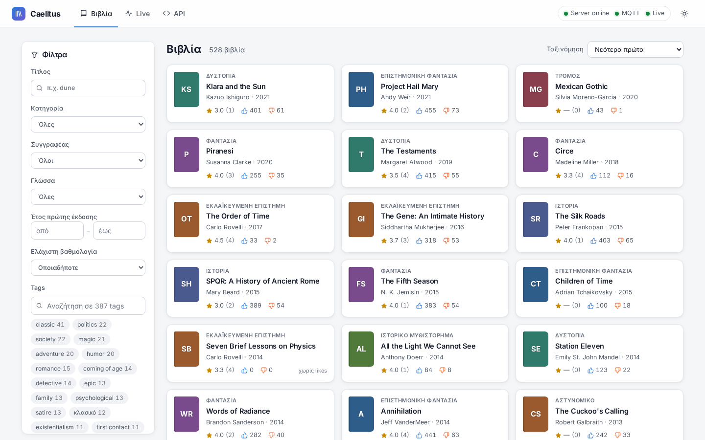
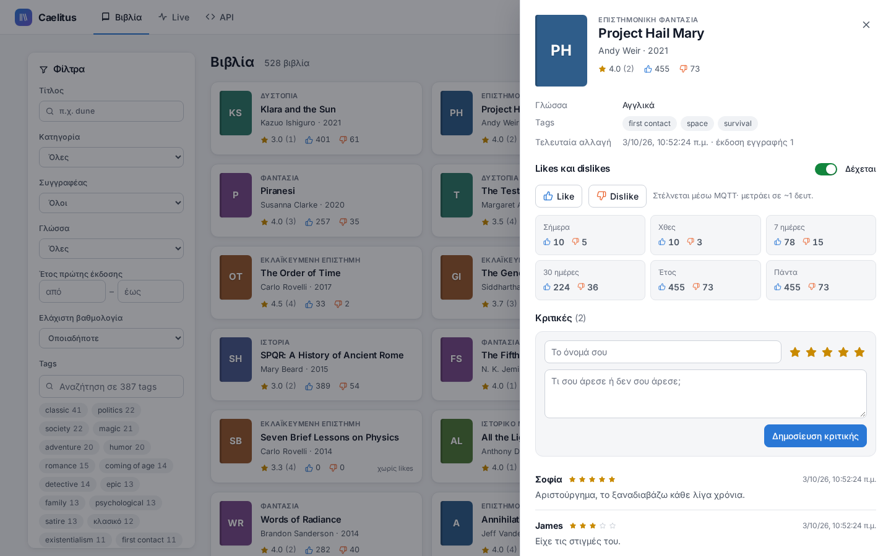
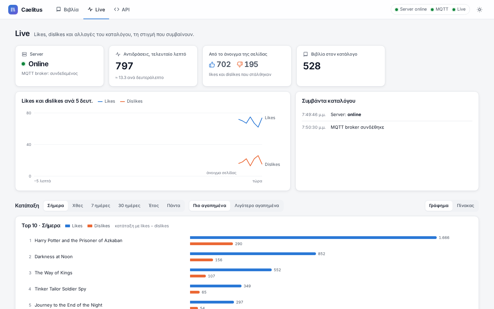
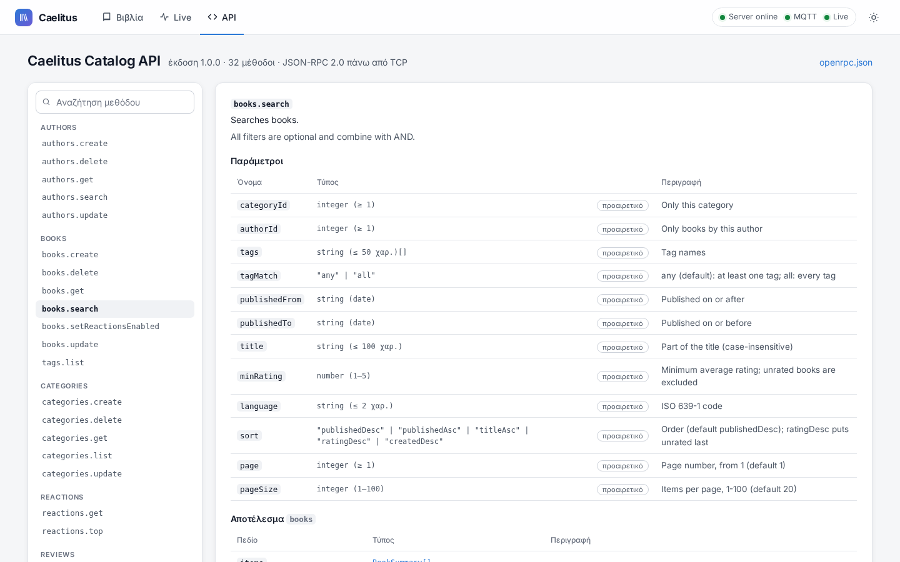
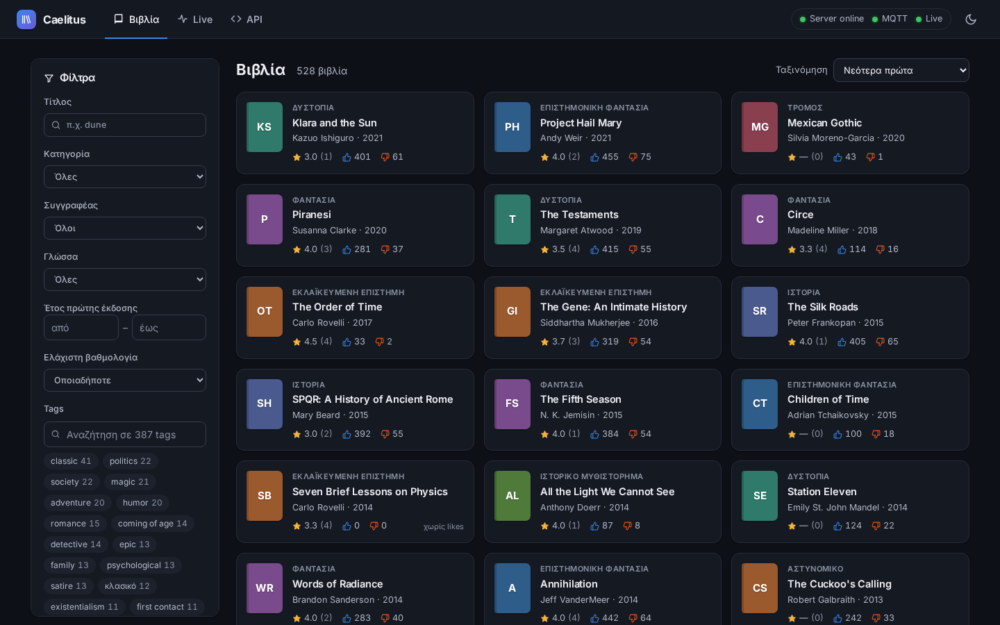
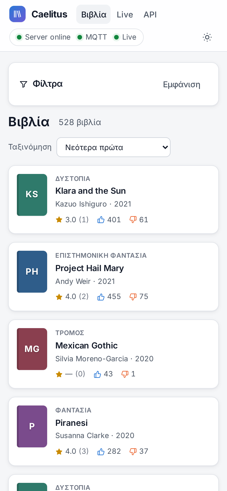
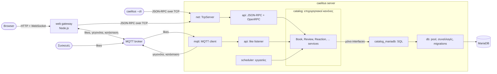
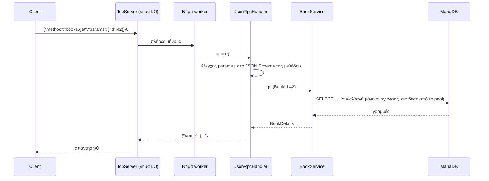

# Caelitus: παρουσίαση

[🇬🇧 English](PRESENTATION.md) · **🇬🇷 Ελληνικά**

Το Caelitus είναι ένας **server καταλόγου βιβλίων σε σύγχρονη C++17**. Οι
clients μιλούν μαζί του με JSON-RPC πάνω από απλό TCP. Αποθηκεύει τα δεδομένα
του σε MariaDB και δέχεται likes και dislikes μέσω MQTT, με όποιον ρυθμό κι αν
έρχονται. Πάνω του έχουν χτιστεί ένα web UI, ένα live dashboard και ένας client
γραμμής εντολών.

Δεν είναι παιχνίδι ούτε framework. Ο στόχος είναι ένα μικρό σύστημα φτιαγμένο
όπως πρέπει να φτιάχνεται ένα σύστημα παραγωγής: καθαρά επίπεδα, API που
περιγράφει τον εαυτό του, ομαλό κλείσιμο, έλεγχοι υγείας, προγραμματισμένες
εργασίες, αυστηρή ρύθμιση και tests που τρέχουν με sanitizers. Ο κατάλογος
βιβλίων είναι το πεδίο εφαρμογής· η μηχανική είναι το ζητούμενο.



---

## Περιεχόμενα

1. [Με μια ματιά](#1-με-μια-ματιά)
2. [Μια περιήγηση](#2-μια-περιήγηση)
3. [Ο client γραμμής εντολών](#3-ο-client-γραμμής-εντολών)
4. [Αρχιτεκτονική](#4-αρχιτεκτονική)
5. [Η διαδρομή ενός αιτήματος](#5-η-διαδρομή-ενός-αιτήματος)
6. [Η διαδρομή ενός like](#6-η-διαδρομή-ενός-like)
7. [Σχεδιαστικές αποφάσεις](#7-σχεδιαστικές-αποφάσεις)
8. [Ποιότητα](#8-ποιότητα)
9. [Τεχνολογίες](#9-τεχνολογίες)
10. [Δοκιμάστε το](#10-δοκιμάστε-το)
11. [Προσανατολισμός στο repository](#11-προσανατολισμός-στο-repository)
12. [Πώς φτιάχτηκε](#12-πώς-φτιάχτηκε)
13. [Τι ακολουθεί](#13-τι-ακολουθεί)

---

## 1. Με μια ματιά

| | |
|---|---|
| **Γλώσσα** | C++17 (server, client), TypeScript (web) |
| **API** | JSON-RPC 2.0 πάνω από TCP, **32 μέθοδοι**, που περιγράφονται από ένα παραγόμενο έγγραφο [OpenRPC](https://open-rpc.org) |
| **Αποθήκευση** | MariaDB, μέσα από ένα επίπεδο ανεξάρτητο από τη βάση: connection pool, συναλλαγές με επαναλήψεις, migrations |
| **Μηνύματα** | MQTT: likes προς τα μέσα, γεγονότα του καταλόγου και κατάσταση του server προς τα έξω |
| **Κώδικας** | περίπου 14.000 γραμμές C++ σε 16 μικρές βιβλιοθήκες· 6.300 γραμμές tests· 3.100 γραμμές TypeScript |
| **Tests** | 262 περιπτώσεις σε 15 εκτελέσιμα, unit και integration, καθαρά με AddressSanitizer, UBSan και ThreadSanitizer |
| **Τεκμηρίωση** | κάθε αρχείο πηγαίου κώδικα τεκμηριωμένο: Doxygen για τη C++, TypeDoc για την TypeScript, και ένα README 1.500 γραμμών |
| **Εκτέλεση** | ένα `docker compose up` σηκώνει όλο το σύστημα με 528 πραγματικά βιβλία |

**Τι κάνει ο server**

- Πλήρης διαχείριση καταλόγου: κατηγορίες, συγγραφείς, βιβλία, κριτικές και
  ελεύθερα tags.
- Αναζήτηση σε κάθε πεδίο: κατηγορία, συγγραφέας, tags (οποιοδήποτε ή όλα),
  έτη, κείμενο τίτλου, ελάχιστη βαθμολογία και γλώσσα, με πέντε ταξινομήσεις
  και σελιδοποίηση.
- Ακριβείς βαθμολογίες: κάθε αλλαγή σε κριτική ενημερώνει το πλήθος και τον
  μέσο όρο του βιβλίου μέσα στην ίδια συναλλαγή.
- Καμία χαμένη ενημέρωση: optimistic locking (`version`) σε βιβλία και
  συγγραφείς.
- Likes και dislikes μέσω MQTT. Μετρώνται στη μνήμη και γράφονται μία φορά το
  δευτερόλεπτο, ανά ημέρα, στη ζώνη ώρας της Αθήνας. Οι κατατάξεις καλύπτουν
  σήμερα, χθες, 7 και 30 ημέρες, έτος και όλη τη διάρκεια.
- Κάθε αλλαγή δημοσιεύεται ως γεγονός στο MQTT, και ένα topic online/offline
  χρησιμοποιεί το last will του broker.
- Ενσωματωμένος scheduler με εργασίες `every`, `rate` και `cron`, και έλεγχος
  υγείας κάθε 15 δευτερόλεπτα, και τα δύο διαθέσιμα μέσω JSON-RPC.
- Ομαλό κλείσιμο χωρίς χαμένο αίτημα ή like, αυτόματα migrations σχήματος,
  επανασύνδεση με τη βάση και τον broker, και logs με όριο συχνότητας.

---

## 2. Μια περιήγηση

### Βιβλία

Όλα τα φίλτρα του API βρίσκονται στην πλαϊνή στήλη, και τα φίλτρα μένουν στη
διεύθυνση (URL), οπότε μια αναζήτηση μπορεί να αποθηκευτεί ως σελιδοδείκτης.
Με ένα κλικ ανοίγει το βιβλίο: τα στοιχεία του, τα likes και dislikes για κάθε
περίοδο (ενημερώνονται ζωντανά), κουμπιά like/dislike, ο διακόπτης που
επιτρέπει στο βιβλίο να δέχεται likes μέσω MQTT, και οι κριτικές με φόρμα για
νέα κριτική.



### Live

Το dashboard δείχνει ό,τι συμβαίνει σε πραγματικό χρόνο. Η κατάσταση του server
έρχεται από το MQTT last will του. Ο ρυθμός των likes και dislikes φτάνει μέσω
WebSocket. Υπάρχει ροή με τα γεγονότα του καταλόγου και κατάταξη για
οποιαδήποτε περίοδο.



Όταν ο server πέσει, εμφανίζεται ειδοποίηση. Το dashboard εξηγεί ότι τα likes
εξακολουθούν να *στέλνονται* αλλά δεν *μετρώνται*, και η κατάταξη γράφει «μη
διαθέσιμη» αντί να δείχνει άδεια λίστα.

### API

Το UI διαβάζει την περιγραφή OpenRPC από τον ίδιο τον server, την ώρα που
τρέχει. Δείχνει κάθε μέθοδο με τις παραμέτρους, το αποτέλεσμα, τα σφάλματα και
τα schemas της, και μια φόρμα «δοκίμασέ το» στέλνει πραγματικά αιτήματα.



### Σκούρο θέμα και κινητά

| | |
|---|---|
|  |  |

---

## 3. Ο client γραμμής εντολών

Το εκτελέσιμο του server είναι και ο client του. Το `caelitus --cli` δεν
ξεκινά server: συνδέεται σε έναν που ήδη τρέχει και του ζητά τις μεθόδους του
(`rpc.discover`). Έτσι **κάθε μέθοδος δουλεύει από τη γραμμή εντολών χωρίς
κανέναν κώδικα στον client**, ακόμα και μέθοδοι που θα προστεθούν στο μέλλον.

```text
$ caelitus --cli books.search --title=dune --sort publishedAsc --pageSize 2 --json | jq -r '.items[].title'
Dune
Dune Messiah

$ caelitus --cli books.get abc
caelitus --cli: --id: expected an integer, got 'abc'

$ caelitus --cli books.serch
caelitus --cli: Unknown method 'books.serch'; did you mean books.search? (help lists them)

$ caelitus --cli
caelitus 1.0.0 at 127.0.0.1:9000, 32 methods. help lists them, Tab completes, Ctrl-D or exit quits.
caelitus> scheduler.pause --name <string>          ← γκρι υπόδειξη: τι λείπει ακόμα
caelitus> books.search --title="Ο Μικρός Πρίγκιπας" --so⇥   →   --sort=  ⇥⇥  publishedDesc  titleAsc  …
```

- **Παράμετροι με τύπο.** Οι τιμές μετατρέπονται σύμφωνα με το JSON Schema
  κάθε παραμέτρου: το `--id=42` γίνεται ακέραιος, το `--tags=a,b` πίνακας και
  ένα σκέτο `--flag` γίνεται true. Μια λέξη χωρίς `--` συμπληρώνει την επόμενη
  υποχρεωτική παράμετρο.
- **Λάθη πριν σταλεί οτιδήποτε.** Άγνωστες μέθοδοι και παράμετροι παίρνουν
  πρόταση «did you mean». Λάθος τύποι και τιμές που λείπουν αναφέρονται τοπικά·
  τα όρια τα ελέγχει ο server, που τα αναφέρει.
- **Interactive prompt** με ιστορικό, συμπλήρωση με Tab για μεθόδους,
  παραμέτρους και τιμές, γκρι υποδείξεις, και UTF-8 παντού (οι ελληνικοί
  τίτλοι δουλεύουν), πάνω στη βιβλιοθήκη replxx.
- **Scripts.** Το `caelitus --cli < commands.txt` εκτελεί μία εντολή ανά
  γραμμή. Οι κωδικοί εξόδου είναι `0` επιτυχία, `1` ο server επέστρεψε
  σφάλμα, `2` λάθος χρήση, `3` δεν υπάρχει server.
- **Ασφαλής επανασύνδεση.** Αν ο server έκλεισε μια αδρανή σύνδεση ή έκανε
  restart, ο client συνδέεται ξανά πριν από την επόμενη εντολή. Ποτέ δεν
  ξαναστέλνει μια εντολή της οποίας η απάντηση χάθηκε, γιατί μπορεί να έχει ήδη
  εκτελεστεί.

---

## 4. Αρχιτεκτονική



**Ένας κανόνας διαμορφώνει τον κώδικα: η επιχειρησιακή λογική δεν ξέρει ποια
βάση δεδομένων ή ποια βιβλιοθήκη MQTT βρίσκεται από πίσω.** Τα services
βλέπουν μόνο interfaces: repositories, έναν διαχειριστή συναλλαγών και έναν
publisher. Η SQL, ο driver της MariaDB και η libmosquitto βρίσκονται σε
ξεχωριστές βιβλιοθήκες, με τις οποίες τα services δεν μπορούν καν να γίνουν
link. Αποτέλεσμα:

- κάθε κανόνας των services ελέγχεται σε χιλιοστά του δευτερολέπτου με fakes
  στη μνήμη·
- η μετάβαση σε PostgreSQL θα σήμαινε νέα repositories και νέο driver, χωρίς
  καμία αλλαγή σε κανένα service·
- ένα service διαβάζεται όπως η περίπτωση χρήσης που υλοποιεί.

Μόνο το `app::Application` τα βλέπει όλα. Δημιουργεί τα συστατικά και τα
συνδέει μεταξύ τους (το *composition root*).

Ο κώδικας C++ χωρίζεται σε **16 βιβλιοθήκες**, καθεμία με μία δουλειά:
`core`, `log`, `json`, `cache`, `scheduler`, `db`, `db_mariadb`, `mqtt`,
`mqtt_mosquitto`, `net`, `catalog`, `catalog_mariadb`, `api`, `config`, `cli`
και `app`. Τα δημόσια headers βρίσκονται στο `include/caelitus/<module>/` και η
υλοποίηση στο `src/<module>/`. Το build επιβάλλει τον γράφο εξαρτήσεων.

---

## 5. Η διαδρομή ενός αιτήματος



- **Το I/O δεν περιμένει ποτέ τη βάση.** Λίγα νήματα Asio μεταφέρουν τα bytes
  όλων των συνδέσεων, και ένα pool από workers εκτελεί τις μεθόδους. Ένα αργό
  query δεν μπορεί να «παγώσει» τους άλλους clients.
- **Οι παράμετροι ελέγχονται με JSON Schema πριν τρέξει οποιοσδήποτε κώδικας
  της μεθόδου.** Από τα ίδια schemas παράγονται το έγγραφο OpenRPC, οι τύποι
  TypeScript του UI και η ανάλυση παραμέτρων του CLI.
- **Καθαρή αντιστοίχιση σφαλμάτων.** Οι εξαιρέσεις της επιχειρησιακής λογικής
  γίνονται σφάλματα JSON-RPC με δεδομένα αναγνώσιμα από μηχανή, για παράδειγμα
  `{"code":"version_conflict"}` ή `{"field":"pageSize","reason":"must be at most 100"}`.
- **Αυτοπροστασία.** Ο server βάζει όρια σε συνδέσεις και μέγεθος μηνυμάτων,
  εφαρμόζει backpressure στα διαδοχικά αιτήματα και κλείνει τις αδρανείς
  συνδέσεις.

---

## 6. Η διαδρομή ενός like

```mermaid
sequenceDiagram
    participant P as Συσκευή / UI
    participant B as MQTT broker
    participant L as Like listener
    participant RS as ReactionService
    participant C as BookCache (μνήμη)
    participant F as εργασία reaction-flush (1 δευτ.)
    participant DB as MariaDB
    P->>B: catalog/in/books/42/like
    B->>L: μήνυμα
    L->>RS: record(42, like)
    RS->>C: δέχεται likes το βιβλίο 42; (χωρίς query)
    RS->>RS: +1 στη μνήμη για (βιβλίο 42, σήμερα)
    F->>RS: flush()
    RS->>DB: μία συναλλαγή με όλα τα μετρημένα
```

Ένα like κοστίζει μία αύξηση σε hash map. Όσα likes κι αν έρθουν, η βάση βλέπει
**μία μικρή συναλλαγή το δευτερόλεπτο**. Οι μετρήσεις κρατιούνται ανά ημέρα
στη ζώνη ώρας της Αθήνας, ώστε «σήμερα» να σημαίνει σήμερα στην Ελλάδα, και μια
νυχτερινή εργασία cron καθαρίζει τις παλιές ημέρες.

---

## 7. Σχεδιαστικές αποφάσεις

| Απόφαση | Γιατί |
|---|---|
| **JSON-RPC 2.0 πάνω από σκέτο TCP**, με πλαισίωση `\0` | Πραγματικό, τεκμηριωμένο πρωτόκολλο χωρίς το βάρος του HTTP· batches και notifications χωρίς κόπο |
| **OpenRPC που παράγεται από τον κώδικα** | Μία πηγή αλήθειας. Η σελίδα API, οι τύποι TypeScript και το CLI τη διαβάζουν όλα, οπότε δεν μπορούν να αποκλίνουν |
| **Interfaces ανάμεσα στα services και την υποδομή** | Services που ελέγχονται εύκολα, και αποθήκευση και μηνύματα που αντικαθίστανται |
| **Σύνολα likes ανά ημέρα με buffer στη μνήμη** | Οποιοσδήποτε ρυθμός likes κοστίζει μία συναλλαγή το δευτερόλεπτο· οι κατατάξεις για κάθε περίοδο βγαίνουν από μικρούς πίνακες |
| **Cache βιβλίων με τη σημαία `reactionsEnabled`** | Κάθε like γίνεται δεκτό ή αγνοείται χωρίς query στη βάση |
| **Optimistic locking** | Δύο άνθρωποι που επεξεργάζονται το ίδιο βιβλίο δεν μπορούν να σβήσουν σιωπηλά ο ένας τις αλλαγές του άλλου |
| **Αυστηρή ρύθμιση** | Τα άγνωστα κλειδιά είναι σφάλματα, οπότε ένα τυπογραφικό λάθος δεν περνά απαρατήρητο. Τα μυστικά έρχονται από `${ENV}` |
| **Scheduler αντί για πρόχειρα νήματα** | Flushes, ανανεώσεις cache, έλεγχοι υγείας και καθαρισμοί είναι όλα επώνυμες εργασίες που φαίνονται και ελέγχονται ζωντανά |
| **Η υγεία ως εργασία** | Ένα πρόβλημα καταγράφεται μία φορά όταν εμφανίζεται και μία όταν λύνεται, όχι κάθε 15 δευτερόλεπτα |
| **Client μέσα στο εκτελέσιμο του server** | Ένα αρχείο για διανομή. Ο client δεν βγαίνει ποτέ εκτός συγχρονισμού με τον server |
| **Gateway για τον browser, χωρίς επίπεδο REST** | Το `POST /rpc` προωθεί αυτούσιο το αίτημα JSON-RPC, οπότε όλη η λογική μένει στη C++ |

---

## 8. Ποιότητα

- **262 περιπτώσεις tests σε 15 εκτελέσιμα.**
  - Τα unit tests τρέχουν σε δευτερόλεπτα χωρίς εξωτερικές υπηρεσίες: fakes
    αντικαθιστούν τη βάση, τη βιβλιοθήκη MQTT και το ρολόι.
  - Τα integration tests τρέχουν πάνω σε πραγματική MariaDB και πραγματικό
    broker, μαζί με ένα end-to-end test της πραγματικής εφαρμογής μέσω TCP και
    MQTT.
- **Sanitizers.** Το preset ανάπτυξης χτίζει με AddressSanitizer και
  UndefinedBehaviorSanitizer, και όλα τα tests τρέχουν καθαρά και με
  ThreadSanitizer.
- **Αυστηρά warnings** (`-Wall -Wextra -Wpedantic -Wshadow -Wold-style-cast
  -Wsign-conversion …`), χωρίς κανένα warning σε GCC ή clang, και ένα
  `.clang-format` για όλο τον κώδικα.
- **Κάθε αρχείο τεκμηριωμένο.**
  - Το Doxygen καλύπτει τον κώδικα C++ (`cmake --build --preset asan --target
    docs`) με μηδέν warnings: κάθε δημόσια κλάση, συνάρτηση και παράμετρο, κάθε
    αρχείο υλοποίησης και κάθε αρχείο tests.
  - Το TypeDoc καλύπτει τον κώδικα web (`npm run docs` στο `web/`).
- **Έλεγχος των αρχείων που παράγονται.** Ένα test αποτυγχάνει αν το
  `db/schema.sql` ή το `docs/openrpc.json` δεν συμφωνεί με τον κώδικα.

---

## 9. Τεχνολογίες

| Τομέας | Επιλογή |
|---|---|
| Γλώσσα και build | C++17, CMake presets, GCC 13 / clang 18 |
| Δικτύωση | Asio (standalone) για τον server· POSIX sockets για τον client |
| JSON | nlohmann/json |
| Βάση δεδομένων | MariaDB 11, MariaDB Connector/C++ |
| MQTT | Mosquitto broker, libmosquitto |
| Logging | spdlog |
| Επεξεργασία γραμμής | replxx |
| Web | Node.js 22, Fastify, React, Vite, TypeScript |
| Τεκμηρίωση | Doxygen + doxygen-awesome-css, TypeDoc, Mermaid |
| Πακετάρισμα | Docker, Docker Compose |

---

## 10. Δοκιμάστε το

Όλα σε containers, χωρίς να χρειάζεται να εγκαταστήσετε τίποτα εκτός από το
Docker:

```bash
git clone https://github.com/elampros/caelitus.git && cd caelitus
docker compose -f docker/compose.yml up -d --build
# ανοίξτε το http://localhost:8080 (φορτώνονται 528 βιβλία)
docker compose -f docker/compose.yml --profile simulate up -d simulator   # ζωντανά likes
docker compose -f docker/compose.yml exec caelitus caelitus --cli system.health
```

Για τοπική ανάπτυξη (build, tests, sanitizers), δείτε το
[quick start του README](../README.md#2-quick-start).

---

## 11. Προσανατολισμός στο repository

| Διαβάστε | Για |
|---|---|
| [README.md](../README.md) | Ο τεχνικός οδηγός: build, εκτέλεση, κάθε module, ρύθμιση, tests, οδηγίες για συνηθισμένες αλλαγές |
| [web/README.md](../web/README.md) | Το UI, ο gateway, το Docker, τα δείγματα δεδομένων και ο προσομοιωτής likes |
| [history.md](../history.md) | Πώς χτίστηκε το project, βήμα προς βήμα, με κάθε απόφαση και κάθε bug |
| `docs/` (χτίζεται με `--target docs`) | Η αναφορά του API της C++ (Doxygen) |
| `web/docs-api/` (χτίζεται με `npm run docs`) | Η αναφορά του API της TypeScript (TypeDoc) |
| [docs/openrpc.json](openrpc.json) | Η περιγραφή του API, που παράγεται από το `caelitus --openrpc` |

```text
include/caelitus/<module>/   δημόσια headers           src/<module>/     υλοποίηση
tests/                       unit + integration         web/              UI, gateway, scripts
db/                          σχήμα + δείγματα           docker/           όλη η στοίβα
```

---

## 12. Πώς φτιάχτηκε

Το Caelitus χτίστηκε βήμα προς βήμα σε συνεργασία με έναν AI βοηθό (Claude),
με τον ιδιοκτήτη του project να αποφασίζει σε κάθε βήμα το εύρος και τον
σχεδιασμό. Η σειρά της δουλειάς ήταν:

1. ένα επίπεδο βάσης δεδομένων που κρύβει τη βάση·
2. το MQTT και ο TCP server·
3. ο κατάλογος και τα likes·
4. το JSON-RPC και το OpenRPC·
5. το web UI·
6. αναδιάρθρωση σε βιβλιοθήκες·
7. τεκμηρίωση·
8. Docker·
9. ο scheduler και οι έλεγχοι υγείας·
10. ο client γραμμής εντολών.

Κάθε βήμα επαληθευόταν με tests πριν ξεκινήσει το επόμενο. Το
[history.md](../history.md) λέει όλη την ιστορία: τι ζητήθηκε, τι προτάθηκε, τι
αποφασίστηκε και από ποιον, και τα bugs που έπιασαν τα tests και οι sanitizers
στην πορεία.

---

## 13. Τι ακολουθεί

**Η Φάση Α, τα θεμέλια, ολοκληρώθηκε.** Πιθανά επόμενα βήματα:

- πίνακες αντί για JSON στις πιο συχνές εντολές του CLI·
- αυτόματα tests για τον web gateway και ένα end-to-end test στον browser·
- αναζήτηση πλήρους κειμένου·
- authentication για το API και το MQTT·
- πολλά instances του server πάνω σε μία βάση, με συγχρονισμένα caches.

---

Διανέμεται με την [άδεια MIT](../LICENSE).
