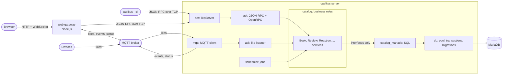
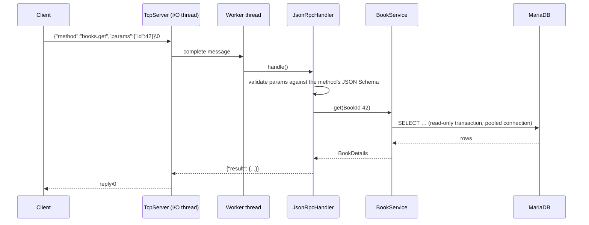
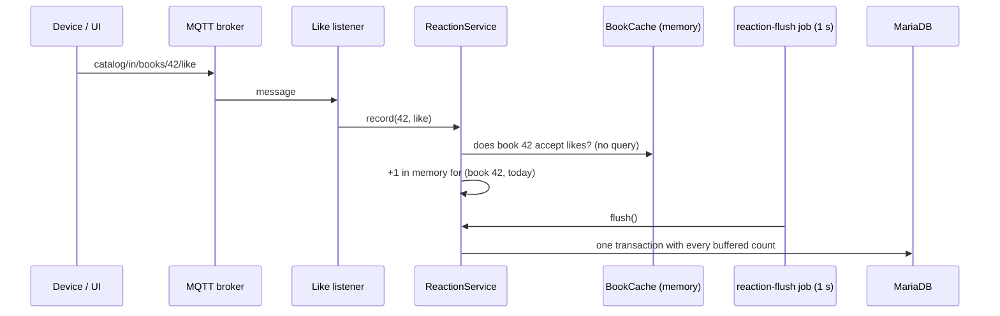

# Caelitus: a presentation

**🇬🇧 English** · [🇬🇷 Ελληνικά](PRESENTATION.el.md)

Caelitus is a **book catalog server in modern C++17**. Clients talk to it with
JSON-RPC over plain TCP. It stores its data in MariaDB and takes likes and
dislikes over MQTT, at any rate. A web UI, a live dashboard and a command-line
client are built on top.

Caelitus is not a toy and not a framework. The aim is a small system built the
way a production system should be: clear layers, a self-describing API,
graceful shutdown, health checks, scheduled jobs, strict configuration, and
tests that run under sanitizers. The book catalog is the domain; the
engineering is the point.


---

## Contents

1. [At a glance](#1-at-a-glance)
2. [A tour](#2-a-tour)
3. [The command-line client](#3-the-command-line-client)
4. [Architecture](#4-architecture)
5. [How a request travels](#5-how-a-request-travels)
6. [How a like travels](#6-how-a-like-travels)
7. [Design decisions](#7-design-decisions)
8. [Quality](#8-quality)
9. [Technology](#9-technology)
10. [Try it](#10-try-it)
11. [Find your way around](#11-find-your-way-around)
12. [How it was built](#12-how-it-was-built)
13. [What comes next](#13-what-comes-next)

---

## 1. At a glance

| | |
|---|---|
| **Language** | C++17 (server, client), TypeScript (web) |
| **API** | JSON-RPC 2.0 over TCP, **32 methods**, described by a generated [OpenRPC](https://open-rpc.org) document |
| **Storage** | MariaDB through a database-neutral layer: connection pool, transactions with retries, migrations |
| **Messaging** | MQTT: likes in, catalog events and a status topic out |
| **Code** | about 14,000 lines of C++ in 16 small libraries; 6,300 lines of tests; 3,100 lines of TypeScript |
| **Tests** | 262 cases in 15 executables, unit and integration, clean under AddressSanitizer, UBSan and ThreadSanitizer |
| **Docs** | every source file documented: Doxygen for C++, TypeDoc for TypeScript, plus a 1,500-line README |
| **Runs** | `docker compose up` brings up the whole system with 528 real books |

**What the server does**

- Full catalog management: categories, authors, books, reviews and free-form tags.
- Search on every field: category, author, tags (any/all), years, title text,
  minimum rating and language, with five sort orders and paging.
- Ratings stay exact: every review change updates the book's count and average
  in the same transaction.
- No lost updates: optimistic locking (`version`) on books and authors.
- Likes and dislikes over MQTT. They are counted in memory and written once a
  second, per day, in the Athens time zone. Rankings cover today, yesterday,
  7/30 days, a year and all time.
- Every change is published as an MQTT event, and an online/offline status
  topic uses the broker's last will.
- A built-in scheduler with `every`, `rate` and `cron` jobs, and a health check
  every 15 seconds, both available over JSON-RPC.
- Graceful shutdown that loses no request and no like, automatic schema
  migrations, reconnects to the database and the broker, and throttled logs.

---

## 2. A tour

### Books

Every filter of the API is in the sidebar, and the filters live in the URL, so
a search can be bookmarked. A click opens the book: its details, likes and
dislikes for every period (updating live), like/dislike buttons, the switch
that lets the book accept likes over MQTT, and reviews with a form to add one.


### Live

The dashboard shows what happens in real time. The server's status comes from
its MQTT last will. The rate of likes and dislikes arrives over a WebSocket.
There is a feed of catalog events, and a ranking for any period.


When the server goes down, a banner says so. The dashboard explains that likes
are still being *sent* but are not *counted*, and the ranking says
"unavailable" instead of showing an empty list.

### API

The UI reads the server's own OpenRPC description at run time. It shows every
method with its parameters, result, errors and schemas, and a "try it" form
sends real requests.


### Dark theme and phones

| | |
|---|---|
|  |  |

---

## 3. The command-line client

The server's executable is also its client. `caelitus --cli` does not start a
server: it connects to a running one and asks it for its methods
(`rpc.discover`). So **every method works from the command line without any
client code**, including methods added in the future.

```text
$ caelitus --cli books.search --title=dune --sort publishedAsc --pageSize 2 --json | jq -r '.items[].title'
Dune
Dune Messiah

$ caelitus --cli books.get abc
caelitus --cli: --id: expected an integer, got 'abc'

$ caelitus --cli books.serch
caelitus --cli: Unknown method 'books.serch'; did you mean books.search? (help lists them)

$ caelitus --cli
caelitus 1.0.0 at 127.0.0.1:9000, 32 methods. help lists them, Tab completes, Ctrl-D or exit quits.
caelitus> scheduler.pause --name <string>          ← grey hint: what is still required
caelitus> books.search --title="Ο Μικρός Πρίγκιπας" --so⇥   →   --sort=  ⇥⇥  publishedDesc  titleAsc  …
```

- **Typed arguments.** Values are converted using each parameter's JSON Schema:
  `--id=42` becomes an integer, `--tags=a,b` an array, and a bare `--flag`
  becomes true. A word without `--` fills the next required parameter.
- **Mistakes caught before sending.** Unknown methods and parameters get "did
  you mean" suggestions. Wrong types and missing values are reported locally;
  limits are left to the server, which reports them.
- **An interactive prompt** with history, Tab completion of methods, parameters
  and values, grey hints, and UTF-8 throughout (Greek titles work), built on
  replxx.
- **Scripts.** `caelitus --cli < commands.txt` runs one command per line. Exit
  codes are `0` ok, `1` the server returned an error, `2` usage error, `3` no
  server.
- **Safe reconnects.** If the server closed an idle connection or restarted,
  the client reconnects before the next command. It never resends a command
  whose reply was lost, because it may already have taken effect.

---

## 4. Architecture



**One rule shapes the code: the business logic does not know which database or
MQTT library is behind it.** The services see only interfaces: repositories, a
transaction manager and a publisher. The SQL, the MariaDB driver and
libmosquitto live in separate libraries, which the services cannot even link
against. As a result:

- every service rule is tested in milliseconds with in-memory fakes;
- moving to PostgreSQL would mean new repositories and a new driver, with no
  change to a single service;
- a service reads like the use case it implements.

Only `app::Application` sees everything. It creates the components and wires
them together (the *composition root*).

The C++ code is split into **16 libraries**, each with one job: `core`, `log`,
`json`, `cache`, `scheduler`, `db`, `db_mariadb`, `mqtt`, `mqtt_mosquitto`,
`net`, `catalog`, `catalog_mariadb`, `api`, `config`, `cli` and `app`. Public
headers live in `include/caelitus/<module>/`, implementation in
`src/<module>/`. The build enforces the dependency graph.

---

## 5. How a request travels



- **I/O never waits on the database.** A few Asio threads move bytes for every
  connection, and a worker pool runs the methods. One slow query cannot freeze
  other clients.
- **Parameters are checked against JSON Schema before any method code runs.**
  The same schemas generate the OpenRPC document, the UI's TypeScript types,
  and the CLI's argument parsing.
- **Errors map cleanly.** Domain exceptions become JSON-RPC errors with
  machine-readable data, for example
  `{"code":"version_conflict"}` or `{"field":"pageSize","reason":"must be at most 100"}`.
- **Self-protection.** The server limits connections and message sizes, applies
  backpressure on pipelined requests, and closes idle connections.

---

## 6. How a like travels



A like costs a hash-map increment. However many likes arrive, the database sees
**one small transaction per second**. Counts are kept per day in the Athens
time zone, so "today" means today in Greece, and old days are cleaned up by a
nightly cron job.

---

## 7. Design decisions

| Decision | Why |
|---|---|
| **JSON-RPC 2.0 over raw TCP**, `\0`-framed | A real, documented protocol without HTTP overhead; batches and notifications come free |
| **OpenRPC generated from the code** | One source of truth. The API page, the TypeScript types and the CLI all read it, so they cannot drift |
| **Interfaces between the services and the infrastructure** | Testable services and replaceable storage and messaging |
| **Per-day like totals with an in-memory buffer** | Any like rate costs one transaction per second; rankings for any period come from small tables |
| **Book cache with a `reactionsEnabled` flag** | Each like is accepted or ignored without a database query |
| **Optimistic locking** | Two people editing one book cannot silently overwrite each other |
| **Strict configuration** | Unknown keys are errors, so a typo cannot pass silently. Secrets come from `${ENV}` |
| **A scheduler instead of ad-hoc threads** | Flushes, cache reloads, health checks and cleanup are all named jobs that can be inspected and controlled live |
| **Health as a job** | Problems are logged once when they appear and once when they clear, not every 15 seconds |
| **Client inside the server binary** | One file to ship. The client is never out of step with the server |
| **Gateway for the browser, no REST layer** | `POST /rpc` forwards the exact JSON-RPC request, so all logic stays in C++ |

---

## 8. Quality

- **262 test cases in 15 executables.**
  - Unit tests run in seconds with no external services: fakes stand in for the
    database, the MQTT library and the clock.
  - Integration tests run against a real MariaDB and a real broker, including
    an end-to-end test of the real application over TCP and MQTT.
- **Sanitizers.** The development preset builds with AddressSanitizer and
  UndefinedBehaviorSanitizer, and the whole suite also runs clean under
  ThreadSanitizer.
- **Strict warnings** (`-Wall -Wextra -Wpedantic -Wshadow -Wold-style-cast
  -Wsign-conversion …`), with no warnings on GCC or clang, and one `.clang-format` for all the code.
- **Every file documented.**
  - Doxygen covers the C++ code (`cmake --build --preset asan --target docs`)
    with zero warnings: every public class, function and parameter, every
    implementation file and every test file.
  - TypeDoc covers the web code (`npm run docs` in `web/`).
- **Generated artifacts are checked.** A test fails if `db/schema.sql` or
  `docs/openrpc.json` is out of date with the code.

---

## 9. Technology

| Area | Choice |
|---|---|
| Language and build | C++17, CMake presets, GCC 13 / clang 18 |
| Networking | Asio (standalone) for the server; POSIX sockets for the client |
| JSON | nlohmann/json |
| Database | MariaDB 11, MariaDB Connector/C++ |
| MQTT | Mosquitto broker, libmosquitto |
| Logging | spdlog |
| Line editing | replxx |
| Web | Node.js 22, Fastify, React, Vite, TypeScript |
| Documentation | Doxygen + doxygen-awesome-css, TypeDoc, Mermaid |
| Packaging | Docker, Docker Compose |

---

## 10. Try it

Everything in containers, with nothing to install but Docker:

```bash
git clone https://github.com/elampros/caelitus.git && cd caelitus
docker compose -f docker/compose.yml up -d --build
# open http://localhost:8080 (528 books are loaded)
docker compose -f docker/compose.yml --profile simulate up -d simulator   # live likes
docker compose -f docker/compose.yml exec caelitus caelitus --cli system.health
```

For local development (build, tests, sanitizers), see
[the README's quick start](../README.md#2-quick-start).

---

## 11. Find your way around

| Read | For |
|---|---|
| [README.md](../README.md) | The technical guide: building, running, every module, configuration, testing, how-tos |
| [web/README.md](../web/README.md) | The UI, the gateway, Docker, sample data and the like simulator |
| [history.md](../history.md) | How the project was built, step by step, with every decision and bug |
| `docs/` (built with `--target docs`) | The C++ API reference (Doxygen) |
| `web/docs-api/` (built with `npm run docs`) | The TypeScript API reference (TypeDoc) |
| [docs/openrpc.json](openrpc.json) | The API description, generated by `caelitus --openrpc` |

```text
include/caelitus/<module>/   public headers           src/<module>/     implementation
tests/                       unit + integration       web/              UI, gateway, scripts
db/                          schema + sample data     docker/           the whole stack
```

---

## 12. How it was built

Caelitus was built step by step in conversation with an AI assistant (Claude),
with the owner deciding scope and design at every step. The work went in this
order:

1. a database layer that hides the database;
2. MQTT and the TCP server;
3. the catalog and the likes;
4. JSON-RPC and OpenRPC;
5. the web UI;
6. a restructure into libraries;
7. documentation;
8. Docker;
9. the scheduler and health checks;
10. the command-line client.

Each step was verified with tests before the next began. [history.md](../history.md)
tells the whole story: what was asked, what was proposed, what was decided and
by whom, and the bugs that tests and sanitizers caught along the way.

---

## 13. What comes next

**Phase A, the foundation, is complete.** Possible next steps:

- tables instead of JSON for the most used CLI commands;
- automated tests for the web gateway and an end-to-end browser test;
- full-text search;
- authentication for the API and MQTT;
- several server instances behind one database, with their caches kept in sync.

---

Licensed under the [MIT License](../LICENSE).
