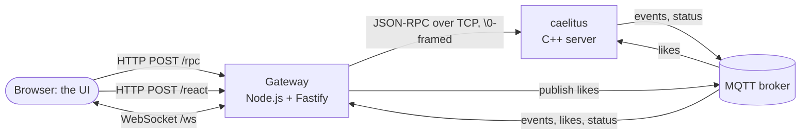

# caelitus web

The web side of caelitus: a **UI** for browsing and managing the book catalog
and watching likes live, and the **gateway** that connects browsers to the C++
server and the MQTT broker. Also here: the script that loads sample data and a
simulator that sends random likes.

For the server itself see the [main README](../README.md).

## Contents

1. [What you get](#1-what-you-get)
2. [How it fits together](#2-how-it-fits-together)
3. [Running it](#3-running-it)
4. [Docker](#4-docker)
5. [Sample data and the like simulator](#5-sample-data-and-the-like-simulator)
6. [The gateway's endpoints](#6-the-gateways-endpoints)
7. [The UI's code](#7-the-uis-code)
8. [Settings](#8-settings)
9. [Commands](#9-commands)
10. [Troubleshooting](#10-troubleshooting)

---

## 1. What you get

Three pages, in Greek, with light and dark themes, usable on a phone:

**Βιβλία (Books).** Search the catalog with every filter the API offers, in a
sidebar (collapsible on narrow screens): title text, category, author,
language, publication years, minimum rating, and tags (the most used ones, a
search box over all of them, any/all matching). The filters in effect appear as
removable chips above the results; they live in the URL, so a search can be
bookmarked or shared. Each book shows a placeholder cover (its initials, colored
by category), rating, likes and dislikes. Clicking a book opens a panel with its
details, its likes and dislikes per period (updating live), like/dislike
buttons, the switch that turns likes on or off for the book, and its reviews
with a form to add one (star rating).

**Live.** A dashboard that updates as things happen:

- the server's online/offline status (from its MQTT status topic), the broker's
  connection, and the catalog size;
- likes and dislikes per 5 seconds over the last 5 minutes, since the page was
  opened;
- the most liked or most disliked books for a chosen period (today, yesterday,
  last 7/30 days, last year, all time), as a chart or a table;
- a feed of catalog events: new and changed books, new reviews.

When the server goes offline, a banner says so and explains that likes still
appear on the chart (they are being *sent* over MQTT) but are **not counted**
until it returns; the ranking says it is unavailable instead of pretending
there were no likes.

**API.** Every method of the server's JSON-RPC API, read live from its OpenRPC
description and grouped by area: parameters, result, possible errors and data
schemas, with a "try it" form that sends a real request and shows the answer.
This includes the operations methods (`system.health`, `scheduler.list`,
`scheduler.run`, `scheduler.pause`, `scheduler.resume`): the page is the
quickest way to see the server's health or to run a job by hand (see
[Server jobs and health](#server-jobs-and-health)).

At the top right, three indicators show the server, the MQTT broker and the
browser's live connection.

---

## 2. How it fits together

A browser cannot open a raw TCP socket, which is what the server speaks. The
gateway, a small Node.js process, sits in between:



- **The API is not translated.** `POST /rpc` carries the exact JSON-RPC request
  to the server and the exact reply back; there is no REST layer to keep in
  sync. All logic stays in C++.
- **A like from the UI travels like a like from a device**: the gateway
  publishes it to `catalog/in/books/<id>/like`, the server receives it from the
  broker. Clicking the button exercises the whole system.
- **Live updates** come from MQTT: the gateway subscribes to the catalog events,
  the likes and the server status, and pushes each message to every open
  WebSocket.
- **The broker is never exposed to browsers**; only the gateway talks to it.

In development, Vite serves the UI on port 5173 with hot reload and proxies the
API paths to the gateway on 8080. In production the gateway serves the built UI
itself, so everything is on one port.

---

## 3. Running it

### What you need

- **Node.js 22.** With [nvm](https://github.com/nvm-sh/nvm), which installs into
  your home directory without `sudo`:
  ```bash
  curl -o- https://raw.githubusercontent.com/nvm-sh/nvm/v0.40.3/install.sh | bash
  source ~/.bashrc
  nvm install 22
  ```
- **The caelitus server** running on port 9000, with its database (see the main
  README, "Quick start").
- **An MQTT broker** on port 1883, for likes and live updates. Without one the UI
  still works for browsing; the live parts stay idle.

### Development

```bash
cd web
npm install          # once, and after dependency changes
npm run seed         # once, into an empty catalog: 528 sample books
npm run dev          # gateway on :8080 + UI on http://localhost:5173 (hot reload)
```

`npm run dev` starts both processes in one terminal (their output is prefixed
`gateway` and `ui`); Ctrl+C stops both. Edit anything under `ui/src/` and the
browser updates at once; the gateway restarts itself when `gateway/src/`
changes.

### Production-style

```bash
npm run build        # generates the API types, type-checks, builds the UI into ui/dist/
npm start            # the gateway serves ui/dist and the API on http://localhost:8080
```

---

## 4. Docker

The repository's `docker/` directory runs everything in containers: MariaDB
(created with the sample catalog), an MQTT broker, the C++ server and this web
app. From the repository root:

```bash
docker compose -f docker/compose.yml up -d --build   # first build: a few minutes
```

Open **http://localhost:8080**.

| Service | Image | Host port | Notes |
|---|---|---|---|
| `web` | `caelitus-web` (`docker/web.Dockerfile`) | 8080 | The gateway serving the built UI |
| `caelitus` | `caelitus-server` (`docker/server.Dockerfile`) | 9000 | The C++ server |
| `mariadb` | `mariadb:11` | 3316 | User `caelitus`, password `caelitus-dev`; filled from `db/sample/catalog.sql` on first start |
| `mosquitto` | `eclipse-mosquitto:2` | 1884 | No authentication (`docker/mosquitto.conf`) |
| `simulator` | `caelitus-web` | | Only with `--profile simulate` |

The host ports are chosen so the stack can run next to a local MariaDB (3306)
and broker (1883). Inside the stack the containers reach each other by service
name (`mariadb`, `mosquitto`, `caelitus`).

Everyday commands:

```bash
docker compose -f docker/compose.yml ps                                  # what is running
docker compose -f docker/compose.yml logs -f caelitus                    # follow the server's log
docker compose -f docker/compose.yml --profile simulate up -d simulator  # random likes
docker compose -f docker/compose.yml stop simulator                      # stop them
docker compose -f docker/compose.yml up -d --build web                   # rebuild after UI changes
docker compose -f docker/compose.yml down                                # stop everything, keep the data
docker compose -f docker/compose.yml down -v                             # ... and delete the database
```

To send likes from the host into the containerized broker:
`mosquitto_pub -p 1884 -t catalog/in/books/1/like -n`.

The images: the server image builds MariaDB Connector/C++ from source (Ubuntu
does not package it) and the server in a build stage, then copies only the
binaries into a slim runtime (~140 MB). The web image (~570 MB) keeps the
development tools because the gateway runs its TypeScript directly with `tsx`;
fine for local use, worth slimming (compile to JavaScript) before deploying
anywhere.

---

## 5. Sample data and the like simulator

### Sample data: `npm run seed`

Loads `db/sample/catalog.json` (14 categories, 328 authors, 528 real books with
their first publication year, made-up reviews) **through the API**, so every
validation rule applies, exactly as if a person had typed it all in the UI.
About 85% of the books accept likes. It takes a few seconds and refuses to run
if the catalog is not empty.

```bash
npm run seed                              # server at 127.0.0.1:9000
CAELITUS_RPC_PORT=9123 npm run seed       # elsewhere
```

To load the same data straight into an empty database, without a running
server, use `db/sample/catalog.sql` (main README, section 5). That script also
contains 60 days of like history, so the rankings have something to show at
once.

### Random likes: `npm run simulate`

Publishes likes and dislikes over MQTT, the way many readers' phones would, so
the Live page has something to show:

```bash
npm run simulate                  # ~20 reactions per second
RATE=100 npm run simulate         # ~100 per second
```

It asks the server which books accept likes, shuffles them, and picks books with
a Zipf-like popularity (a few books get most of the likes, as in real life); one
book in seven is mostly disliked, so the "most disliked" ranking is not empty.
Every 10 seconds' worth of messages it prints a count. Stop it with Ctrl+C.

Watch the effect on the Live page, or directly:

```bash
mosquitto_sub -t 'catalog/in/books/#' -v       # the raw likes
```

---

## 6. The gateway's endpoints

| Method and path | Body | Answer |
|---|---|---|
| `POST /rpc` | A JSON-RPC request or batch | The server's reply, unchanged; `204` for notifications only; `502` with error `-32003` if the server is unreachable |
| `GET /openrpc.json` | | The API description (the server's `rpc.discover`) |
| `POST /react` | `{"bookId": 42, "kind": "like"}` (or `"dislike"`) | `202 {"accepted": true}`; `400` for a bad body; `503` if the broker is not connected |
| `GET /health` | | `{"gateway": "up", "server": "up" \| "down" \| "error", "broker": "up" \| "down"}` |
| `GET /ws` | WebSocket | A stream of JSON messages (below) |
| `GET /*` | | The built UI (`ui/dist`), when it exists; unknown paths return `index.html` so the UI's routes work on reload |

```bash
curl -s localhost:8080/health
curl -s -H 'content-type: application/json' localhost:8080/rpc \
     -d '{"jsonrpc":"2.0","id":1,"method":"reactions.top","params":{"period":"today","limit":3}}'
curl -s -H 'content-type: application/json' localhost:8080/react -d '{"bookId":1,"kind":"like"}'
```

### Server jobs and health

`GET /health` only says whether each piece is **reachable** (for the server it
sends `system.ping`). What the server is actually doing is one JSON-RPC call
away, through the same `POST /rpc`:

```bash
rpc() { curl -s -H 'content-type: application/json' localhost:8080/rpc -d "$1"; echo; }
rpc '{"jsonrpc":"2.0","id":1,"method":"system.health"}'      # status "ok" or "degraded", plus "problems"
rpc '{"jsonrpc":"2.0","id":2,"method":"scheduler.list"}'     # every job: schedule, paused, last run, last error
rpc '{"jsonrpc":"2.0","id":3,"method":"scheduler.run","params":{"name":"book-cache-reload"}}'
```

The server runs its periodic work as named jobs (the full list, schedules and
configuration are in the main README,
[Scheduled jobs and health](../README.md#scheduled-jobs-and-health)). The ones
you can see from the web side:

| Job | Default | What you notice in the UI |
|---|---|---|
| `reaction-flush` | every second | A like is counted (rankings, the book panel's numbers) up to about a second after it is sent; the book panel re-reads its numbers 1.3 s after a click for that reason. Paused or failing, the Live chart still moves but nothing is counted |
| `book-cache-reload` | every 5 minutes | Turning likes on for a book through the API takes effect at once; a change made directly in the database is picked up within 5 minutes (or run the job by hand) |
| `health` | every 15 seconds | Feeds `system.health`; the simulator at a high `RATE` can make it report a full like buffer |
| `top-books` | every minute | Publishes today's top 10 (retained) to `catalog/stats/top-today` for MQTT devices. The UI does not use it: its rankings call `reactions.top`, which covers every period |
| `reaction-cleanup` | 03:00 Athens time | Old per-day counts disappear; "all time" totals are kept |

A job paused with `scheduler.pause` stays paused until `scheduler.resume` or a
server restart.

### WebSocket messages (`/ws`)

Every message is one JSON object with a `type` and the time `at` (ISO 8601):

| `type` | Fields | Sent when |
|---|---|---|
| `broker` | `connected` | On connect, and whenever the gateway's broker connection changes |
| `status` | `server` (`online` / `offline`) | The server's status topic changes; the last value is also sent to every new client |
| `reaction` | `bookId`, `kind` (`like` / `dislike`) | A like or dislike was published (by anyone) |
| `event` | `bookId`, `event` (`created`, `updated`, `deleted`, `reviews`), `payload` | The server published a catalog event |

```bash
npx wscat -c ws://localhost:8080/ws        # watch them in a terminal
```

Note that `reaction` messages are likes *sent* over MQTT. Whether the server
counted them (the book must accept likes, and the server must be running)
shows in `reactions.get`.

---

## 7. The UI's code

```text
web/
├── package.json             workspaces (gateway, ui) and the top-level scripts
├── typedoc.json, tsconfig.docs.json   code documentation (npm run docs)
├── gateway/src/
│   ├── server.ts            HTTP endpoints, WebSocket, static UI (Fastify)
│   ├── rpcClient.ts         JSON-RPC over TCP: connection pool, \0 framing, timeouts
│   └── live.ts              MQTT ↔ WebSocket bridge
├── ui/
│   ├── index.html, vite.config.ts
│   └── src/
│       ├── main.tsx         layout, navigation, status indicators, theme switch
│       ├── styles.css       the whole look: colors, spacing, components (light and dark)
│       ├── api/
│       │   ├── generated.ts types of every method and schema (generated: npm run gen)
│       │   ├── client.ts    rpc("books.get", {id}) — typed calls through /rpc
│       │   ├── live.ts      the WebSocket as React hooks (useLive, useLiveState)
│       │   ├── titles.ts    book titles cache for the live views
│       │   └── format.ts    numbers, dates, period names in Greek
│       ├── pages/           BooksPage, DashboardPage (Live), ApiPage
│       └── components/      BookPanel, RateChart, TopBooks, Bits (cover, rating,
│                            likes), Icons (inline SVG line icons)
└── scripts/
    ├── gen-types.ts         docs/openrpc.json → ui/src/api/generated.ts
    ├── seed.ts              db/sample/catalog.json → the API
    └── simulate-likes.ts    random likes over MQTT
```

### Types from the API description

`ui/src/api/generated.ts` is generated from `docs/openrpc.json`, which the C++
build produces. Every call is checked by TypeScript:

```ts
const book = await rpc("books.get", { id: 42 });        // book: Book
await rpc("books.get", { id: "42" });                   // compile error: id must be a number
await rpc("books.search", { titel: "dune" });           // compile error: unknown parameter
```

After changing the server's API:

```bash
cmake --build --preset asan --target openrpc   # repository root: rewrite docs/openrpc.json
npm run gen                                    # web/: regenerate the types
npm run typecheck                              # shows every place in the UI that must change
```

### Adding something to the UI

- **A new call:** use `rpc("<method>", params)` from `api/client.ts`; the result
  is typed.
- **Live data:** `useLive((m) => …)` receives every WebSocket message;
  `useLiveState()` gives the current server/broker/socket status.
- **A new page:** a component in `pages/`, a `<Route>` and a `<NavLink>` in
  `main.tsx`.
- **Styling:** plain CSS in `styles.css`, using the CSS variables at its top
  (colors, radii, shadows) so both themes keep working. The font is Inter,
  bundled with the app (`@fontsource-variable/inter`, Greek included), so it
  works offline. The likes/dislikes chart colors are validated for color-blind
  readers and contrast in both themes; keep them when restyling.
- **Documentation:** every file opens with a TSDoc `@module` comment and every
  export has a `/** ... */` comment; keep it that way for new code.

### Code documentation: `npm run docs`

[TypeDoc](https://typedoc.org) turns the TSDoc comments of the gateway, the UI
and the scripts into a website, one page per file:

```bash
npm run docs                 # writes docs-api/ (not committed)
xdg-open docs-api/index.html
```

Its settings are in `typedoc.json`, with `tsconfig.docs.json`, which compiles
the three parts together. The comments of `ui/src/api/generated.ts` come from
the descriptions of the API's schemas in C++, through `npm run gen`.

---

## 8. Settings

Environment variables of the gateway and the scripts (all optional):

| Variable | Default | Used by | Meaning |
|---|---|---|---|
| `PORT` | 8080 | gateway | HTTP port |
| `CAELITUS_RPC_HOST`, `CAELITUS_RPC_PORT` | 127.0.0.1, 9000 | gateway, seed, simulator | The C++ server |
| `MQTT_URL` | `mqtt://127.0.0.1:1883` | gateway, simulator | The broker |
| `REACTION_TOPIC_PREFIX` | `catalog/in/books` | gateway, simulator | Must match the server's `catalog.reactions.topicPrefix` |
| `EVENT_TOPIC_PREFIX` | `catalog/books` | gateway | Catalog events |
| `STATUS_TOPIC` | `caelitus/status` | gateway | Must match the server's `mqtt.will.topic` |
| `LOG_LEVEL` | `info` | gateway | Fastify log level |
| `RATE` | 20 | simulator | Reactions per second |
| `GATEWAY_URL` | `http://127.0.0.1:8080` | Vite (dev) | Where the dev server proxies the API |

---

## 9. Commands

All from `web/`:

| Command | Does |
|---|---|
| `npm install` | Installs the dependencies of the gateway and the UI |
| `npm run dev` | Gateway (port 8080) and UI dev server (port 5173), with reload on changes |
| `npm run build` | Types from the API, type-check, production build of the UI |
| `npm start` | The gateway, serving the built UI |
| `npm run seed` | Loads the sample catalog through the API |
| `npm run simulate` | Random likes over MQTT |
| `npm run gen` | Regenerates `ui/src/api/generated.ts` |
| `npm run typecheck` | Strict TypeScript check of gateway and UI |
| `npm run docs` | TypeScript API documentation in `docs-api/` (TypeDoc) |

---

## 10. Troubleshooting

| Symptom | Cause and fix |
|---|---|
| Top right shows "Server offline" | The C++ server is not running (or stopped); start it. The gateway keeps working and reconnects by itself |
| "MQTT εκτός" | No broker at `MQTT_URL`; start mosquitto. Browsing still works |
| Every API call answers `-32003` | The gateway cannot reach the server at `CAELITUS_RPC_HOST:CAELITUS_RPC_PORT` |
| `npm run seed`: "The catalog already has N books" | Seeding only runs on an empty catalog; recreate the database or skip it |
| `npm run simulate`: "No books accept likes yet" | Seed first, or enable likes on some books (the switch in the book panel) |
| Likes on the Live chart but rankings do not move | The server is down or the books do not accept likes: the chart shows likes *sent*, rankings show likes *counted* |
| Server online, likes counted nowhere (rankings and the book panel stay still) | The `reaction-flush` job is paused or failing: `scheduler.list` (API page or `/rpc`) shows its `paused` flag and last error; `scheduler.resume` with `{"name":"reaction-flush"}` |
| Is the server healthy? | `system.health` on the API page: `status` is `degraded` and `problems` says why (database slow or down, broker lost, like buffer full, a job failing) |
| `npm run dev`: port 5173 or 8080 in use | Another dev server or the Docker stack is running: stop it, or `PORT=8081 GATEWAY_URL=http://127.0.0.1:8081 npm run dev` |
| TypeScript errors after pulling changes | `npm run gen` (the API changed), then `npm run typecheck` |
| `npm: command not found` in a new terminal | nvm is not loaded: `source ~/.nvm/nvm.sh` (or open a login shell) |
